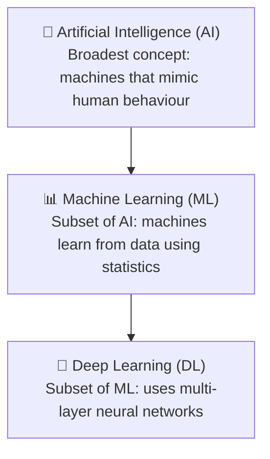
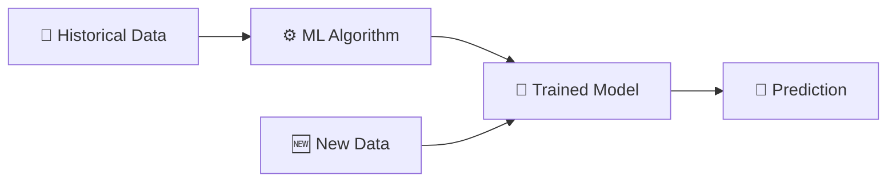
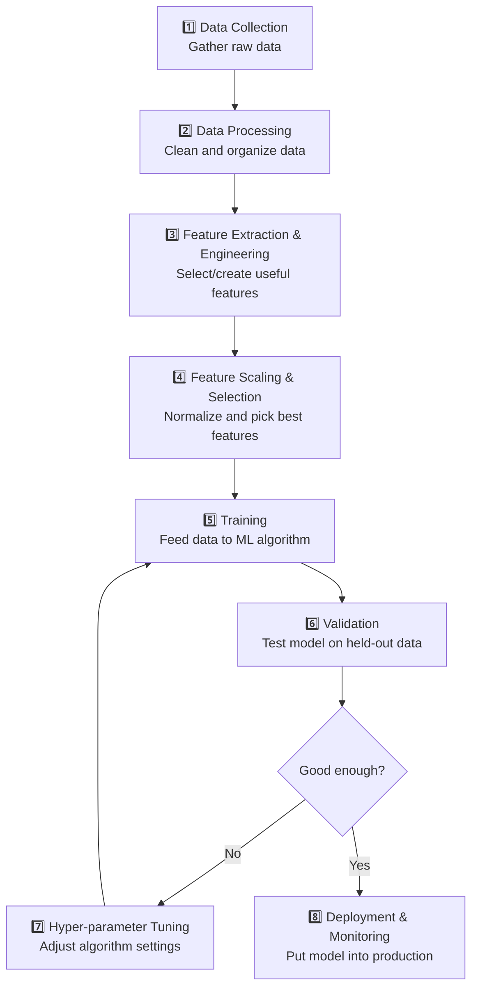
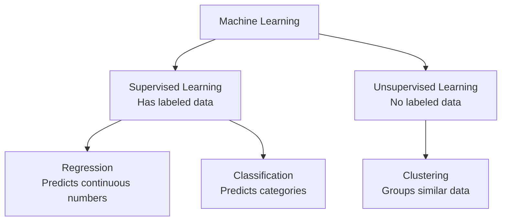

# 📘 Week 1 Study Notes: Introduction to Machine Learning

> **Course:** COS30082 — Applied Machine Learning

> **Topic:** Basics of Machine Learning

> **Prepared for:** Someone with zero prior ML knowledge

---

## Table of Contents

1. [What is Computer Vision?](#1-what-is-computer-vision)
2. [How Do Computers "See"?](#2-how-do-computers-see)
3. [Challenges in Computer Vision](#3-challenges-in-computer-vision)
4. [The Big Picture: AI vs ML vs DL](#4-the-big-picture-ai-vs-ml-vs-dl)
5. [What is Machine Learning?](#5-what-is-machine-learning)
6. [How ML Actually Works (The Math Intuition)](#6-how-ml-actually-works-the-math-intuition)
7. [The ML Process (Step by Step)](#7-the-ml-process-step-by-step)
8. [ML vs Rule-Based Systems](#8-ml-vs-rule-based-systems)
9. [Types of Machine Learning](#9-types-of-machine-learning)
10. [What is Deep Learning?](#10-what-is-deep-learning)
11. [Traditional ML vs Deep Learning](#11-traditional-ml-vs-deep-learning)
12. [How Neural Networks Learn](#12-how-neural-networks-learn)
13. [Computer Vision Applications](#13-computer-vision-applications)
14. [Natural Language Processing (NLP)](#14-natural-language-processing-nlp)
15. [Deep Learning Frameworks](#15-deep-learning-frameworks)
16. [TensorFlow Walkthrough: MNIST Example](#16-tensorflow-walkthrough-mnist-example)
17. [Key Takeaways](#17-key-takeaways)
18. [Glossary](#18-glossary)

---

## 1. What is Computer Vision?

### Simple Explanation

**Computer Vision (CV)** is a field that teaches computers to "see" and understand images and videos — just like humans do with their eyes and brain.

When you look at a photo of people on a beach, you can instantly answer:
- How many people are there?
- What are they doing?
- Where is this happening?
- What emotions do they show?
- What objects are present?

Computer Vision tries to give machines this same ability.

### Real-World Analogy

> Think of Computer Vision like teaching a baby to see. A baby doesn't know what a "dog" is at first. After seeing hundreds of dogs and being told "that's a dog," the baby learns. Computer Vision works the same way — we show the computer thousands of images and teach it to recognize patterns.

---

## 2. How Do Computers "See"?

### The Problem: Computers Don't See Like Humans

Humans look at a leaf and think: *"That's an oak leaf."* But a computer just sees a grid of numbers (pixels). It has no built-in understanding of shapes, colors, or objects.

To make a computer "understand" visual data, researchers have traditionally extracted **features** — specific measurable properties of an image:

| Feature Type | What It Captures | Example |
|---|---|---|
| **Shape** | Outline, curvature, contour of objects | The jagged edge of a maple leaf vs. the smooth edge of a eucalyptus leaf |
| **Texture** | Surface patterns and roughness | Rough bark vs. smooth glass |
| **Venation** | Vein patterns (in leaves, for instance) | Parallel veins vs. branching veins |

### Example: Identifying Leaf Species
<p align="center">
  
  &nbsp;&nbsp;&nbsp;&nbsp;
  
</p>

Imagine you have two types of leaves:
- **Leaf A** (species: *Q. acutissima*) — has jagged, serrated edges
- **Leaf B** (species: *Q. × hispanica*) — has smooth, rounded edges

A computer can be taught to tell them apart by measuring features like:
- **Edge curvature** (jagged vs. smooth)
- **Vein pattern** (how veins branch)
- **Surface texture** (shiny vs. matte)

> [!NOTE]
> In traditional computer vision, **humans** had to decide which features to extract (e.g., edges, textures). This is called **hand-crafted feature engineering**. Deep Learning changed this by letting the computer discover its own features automatically.

---

## 3. Challenges in Computer Vision

Even humans sometimes struggle to recognize things. Computers face these challenges too — and they're even harder for machines:

| Challenge | What It Means | Example |
|---|---|---|
| **Viewpoint** | The same object looks different from different angles | A car seen from the front vs. the side vs. the top |
| **Illumination** | Lighting changes how things look | A face in bright sunlight vs. dim candlelight |
| **Scale** | Objects appear different sizes depending on distance | A cat close to the camera vs. far away |
| **Occlusion** | Parts of objects are hidden by other objects | A person standing behind a tree — you only see half their body |

### Why This Matters

These challenges explain why building a computer that "sees" reliably is so hard. A computer trained only on front-facing cars might fail to recognize a car seen from above. This is why we need massive amounts of diverse training data.

---

## 4. The Big Picture: AI vs ML vs DL

These three terms are often confused. Here's how they relate — think of them as **nested circles**:



### Definitions (in plain language)

| Term | What It Is | Everyday Example |
|---|---|---|
| **Artificial Intelligence (AI)** | Any technique that enables machines to mimic human behaviour | A chess-playing program, Siri, self-driving cars |
| **Machine Learning (ML)** | A subset of AI where machines **learn patterns from data** instead of being explicitly programmed | Netflix recommending movies based on what you've watched |
| **Deep Learning (DL)** | A subset of ML that uses **neural networks with many layers** to learn very complex patterns | Identifying faces in photos, translating languages |

### Simple Analogy

> **AI** is like saying "I want a robot that can cook."
> **ML** is like saying "I'll give the robot thousands of recipes and let it figure out cooking patterns."
> **DL** is like saying "I'll give the robot raw ingredients and video of chefs cooking, and let it learn everything on its own — from chopping to seasoning."

---

## 5. What is Machine Learning?

### The Official Definition

> *"Machine Learning (ML) at its most basic is the practice of using algorithms to parse data, learn from it, and then make a determination or prediction about something in the world."* — Nvidia

### In Simple Terms

ML is the process of:
1. **Feeding historical data** into an algorithm
2. The algorithm **learns patterns** from that data
3. The algorithm produces a **model** (a trained "brain")
4. The model can then **make predictions** on new, unseen data

### Visual Workflow



### Example: Predicting House Prices

1. **Historical data:** You collect data on 10,000 houses — their size, location, number of bedrooms, and the price they sold for.
2. **Training:** You feed this data to an ML algorithm. It learns that bigger houses in good locations tend to cost more.
3. **Prediction:** You show the model a new house (3 bedrooms, 150 sqm, downtown). The model predicts: *"This house will sell for about $450,000."*

> [!IMPORTANT]
> The key idea: **you don't write the rules yourself.** Instead of programming "if bedrooms > 3 and location = downtown, then price = high," you let the algorithm **discover these rules automatically** from data.

---

## 6. How ML Actually Works (The Math Intuition)

### The Core Idea: Approximating an Unknown Function

In the real world, there's a **true relationship** between inputs and outputs. For example:
- Input: a house's features (size, location, age)
- Output: its selling price

This true relationship is called the **target function** $f$, and it maps inputs $X$ to outputs $Y$:

$$f: X \rightarrow Y$$

**The problem:** We don't know what $f$ is! We can't see the "true formula" for house prices.

**The solution:** We use an ML algorithm to find a **hypothesis function** $g$ that approximates $f$:

$$g \approx f$$

### How the Algorithm Learns

Given training data $D = \{(x_1, y_1), (x_2, y_2), \ldots, (x_n, y_n)\}$, where:
- $x_i$ = input features (e.g., house size, bedrooms)
- $y_i$ = known output (e.g., actual sale price)

The ML algorithm searches through many possible functions to find $g$ that best fits this data.

### Simple Example

Suppose we have 5 houses:

| House | Size (sqm) | Price ($) |
|-------|-----------|-----------|
| 1 | 50 | 200,000 |
| 2 | 80 | 320,000 |
| 3 | 120 | 480,000 |
| 4 | 150 | 600,000 |
| 5 | 200 | 800,000 |

The ML algorithm might discover: $g(x) = 4000 \times x$ (price ≈ 4000 × size)

Now, for a **new** house of 100 sqm, it predicts: $g(100) = 4000 \times 100 = \$400{,}000$

> [!NOTE]
> The hypothesis $g$ will never be perfect (i.e., $g \neq f$ exactly). There's always some error. The goal is to make $g$ as close to $f$ as possible.

---

## 7. The ML Process (Step by Step)

Building an ML model is not just "press a button." It's a systematic process:



### Each Step Explained

| Step | What Happens | Example |
|------|-------------|---------|
| **Data Collection** | Gather raw data from various sources | Scraping house listings from real estate websites |
| **Data Processing** | Clean the data — handle missing values, remove duplicates, fix errors | Removing entries with missing prices |
| **Feature Extraction** | Identify which pieces of information (features) matter | Size, location, number of bathrooms |
| **Feature Scaling** | Normalize features so they're on the same scale | Converting size (50–200 sqm) and price (200K–800K) to a 0–1 scale |
| **Training** | Run the ML algorithm on the data to build a model | The algorithm adjusts its internal parameters to fit the data |
| **Validation** | Test the model on data it hasn't seen before | Check predictions against actual prices of 1,000 held-out houses |
| **Hyper-parameter Tuning** | Adjust the algorithm's settings to improve performance | Changing the learning rate, number of layers, etc. |
| **Deployment** | Put the trained model into a real application | Embedding the model into a real estate app |

---

## 8. ML vs Rule-Based Systems

### What is a Rule-Based System?

A **rule-based system** uses manually written if-then rules:

```
IF income > 50,000 AND credit_score > 700 AND debt < 10,000
THEN approve_loan = YES
ELSE approve_loan = NO
```

A human programmer writes every rule. The system just follows them blindly.

### How ML is Different

In ML, **no one writes the rules.** The algorithm discovers patterns from data on its own:

```
Given 100,000 past loan applications (with outcomes),
the ML model LEARNS which factors matter and how they interact.
It might discover that credit_score matters most,
but age and employment history also play a role — 
in ways no human explicitly programmed.
```

### Side-by-Side Comparison

| Feature | Rule-Based System | Machine Learning |
|---------|-------------------|------------------|
| **Who creates the rules?** | Humans write them | Algorithm learns them from data |
| **Output type** | Deterministic (same input → always same output) | Probabilistic (same input → a prediction with a confidence level) |
| **Scalability** | Hard to scale (more rules = more complexity) | Easily scalable (just add more data) |
| **Data requirement** | Works with small, simple data | Needs large, high-quality datasets |
| **Adaptability** | Rules must be manually updated | Model can be retrained when data changes |

### When to Use Each

| Use Rule-Based When... | Use ML When... |
|------------------------|----------------|
| You have small amounts of data | You have large amounts of data |
| The rules are simple and clear | The rules are complex or unknown |
| You need instant, guaranteed output | You can tolerate probabilistic predictions |
| The data distribution is constant | Data patterns change over time |

### Example

> **Rule-based:** A thermostat. "IF temperature < 20°C THEN turn on heater." Simple, clear, no learning needed.
>
> **Machine Learning:** Email spam detection. It's impossible to write rules for every possible spam email. Instead, you train a model on millions of emails labeled "spam" or "not spam," and it learns to identify patterns like suspicious links, certain keywords, and unusual senders.

---

## 9. Types of Machine Learning

Machine Learning is divided into two main categories:



---

### 9.1 Supervised Learning

**What it is:** The algorithm learns from **labeled data** — data that already has the correct answers attached.

> Think of it like a student learning with an answer key. The student (algorithm) looks at the questions (inputs) and the correct answers (labels), and learns the patterns.

**How it works:**

1. You provide **training data** with inputs AND correct outputs (labels)
2. The algorithm learns the mapping from inputs → outputs
3. You test it on **new, unseen data** (testing data) to see if it learned correctly

**Example:** Teaching a model to distinguish apples from oranges:

<p align="center">
  
</p>

- Training data: 100 photos of apples (labeled "apple") + 100 photos of oranges (labeled "orange")
- The model learns features that distinguish them (color, shape, texture)
- Test: Show it a new fruit photo, for example apple → it predicts either "apple" or "orange"

#### Regression (Supervised)

**Predicts a continuous number** — a value that can be any real number.

$$f: X \rightarrow y \quad \text{where } y \in \mathbb{R} \text{ (a continuous value)}$$

| Example Problem | Input Features | Output (Prediction) |
|----------------|---------------|---------------------|
| House price prediction | Size, location, bedrooms | $450,000 (a number) |
| Student height prediction | Age, gender, parent heights | 175.3 cm (a number) |
| Temperature forecasting | Date, humidity, wind speed | 28.5°C (a number) |

> **Key characteristic:** The answer is a **number on a sliding scale**, not a category.

#### Classification (Supervised)

**Predicts a discrete category/label** — the answer is one of a fixed set of options.

$$f: X \rightarrow y \quad \text{where } y \in \{c_1, c_2, \ldots, c_k\} \text{ (a category)}$$

| Example Problem | Input Features | Output (Prediction) |
|----------------|---------------|---------------------|
| Gender detection | Photo of a face | "Boy" or "Girl" |
| Email filtering | Email text, sender, links | "Spam" or "Not Spam" |
| Emotion recognition | Facial features | "Happy", "Sad", "Angry" |
| Disease diagnosis | Patient symptoms, lab results | "Healthy" or "Sick" |

> **Key characteristic:** The answer is a **category from a list**, not a number.

### How to Tell Regression from Classification

> **Ask yourself:** Is the output a **number** or a **category**?
> - "How much?" → Regression
> - "Which one?" → Classification

---

### 9.2 Unsupervised Learning

**What it is:** The algorithm learns from **unlabeled data** — data that does NOT have correct answers attached.

> Think of it like sorting a pile of mixed Lego bricks by color without anyone telling you the color names. You group similar-looking bricks together on your own.

**How it works:**

1. You provide data **without any labels**
2. The algorithm finds **hidden patterns or groupings** in the data
3. It organizes data into clusters based on similarity

**Example: Customer Segmentation**

A store has purchase data for 10,000 customers but no labels. The unsupervised algorithm might discover:
- **Cluster A:** Young people who buy electronics and fast food
- **Cluster B:** Families who buy groceries and children's clothing
- **Cluster C:** Elderly customers who buy health products

Nobody told the algorithm these groups exist — it found them on its own!

---

## 10. What is Deep Learning?

### Simple Explanation

**Deep Learning (DL)** is a special type of Machine Learning that uses **neural networks with many layers** (hence "deep") to automatically learn complex features from raw data.

### The Evolution: From Rules to Deep Learning

| Approach | How It Works | Who Designs Features? |
|----------|-------------|----------------------|
| **Rule-based systems** | Human writes rules manually | No features — just rules |
| **Classic ML** | Human designs features, algorithm learns mapping | **Human** selects features |
| **Representation Learning** | Algorithm learns its own features | **Algorithm** learns features |
| **Deep Learning** | Algorithm learns hierarchy of features (simple → complex) | **Algorithm** learns layered features |

### What "Deep" Means

"Deep" refers to the **number of layers** in a neural network:

```
Input → [Layer 1: Edges] → [Layer 2: Textures] → [Layer 3: Parts] → [Layer 4: Objects] → Output
```

Each layer learns increasingly complex features:

| Layer | What It Learns | Example (Face Recognition) |
|-------|---------------|---------------------------|
| Layer 1 | Simple edges and lines | Detects edges of the nose, eyes, mouth |
| Layer 2 | Textures and small patterns | Detects skin texture, eye color patterns |
| Layer 3 | Parts of objects | Detects a whole eye, a nose, lips |
| Layer 4+ | Entire objects | Recognizes the full face as "Person A" |

### Analogy

> Imagine building a face out of Lego. **Layer 1** gives you individual bricks (edges). **Layer 2** snaps a few bricks together into small shapes (textures). **Layer 3** builds bigger structures like an eye or a nose. **Layer 4** assembles everything into a complete face. Deep Learning does this automatically!

### What is "Learning" in Deep Learning?

The "Learning" part means the algorithm adjusts its internal parameters (**weights** and **biases**) based on data. It's like turning thousands of tiny knobs until the output matches what you expect.

---

## 11. Traditional ML vs Deep Learning

### Key Differences

| Aspect | Traditional ML | Deep Learning |
|--------|---------------|---------------|
| **Feature design** | Humans manually select features (e.g., edge detection, color histograms) | Algorithm automatically learns features |
| **Hardware** | Runs on regular CPUs | Requires powerful GPUs for parallel computing |
| **Data requirements** | Works well with small datasets | Needs massive datasets to perform well |
| **Problem solving approach** | Breaks problem down step by step | End-to-end learning (input → output directly) |
| **Interpretability** | Features are easy to understand and explain | Features are hard to explain ("black box") |
| **Performance vs. data** | Plateaus as data increases | Keeps improving with more data |

### Performance vs. Data Amount

<p align="center">
  
</p>

> [!TIP]
> **Rule of thumb:**
> - **Small dataset** (hundreds to thousands of samples) → Use traditional ML
> - **Large dataset** (tens of thousands or more) → Use Deep Learning

### Example: Plant Disease Detection

<p align="center">
  
</p>

**Traditional ML approach:**
1. Collect plant images
2. Human expert manually designs features: shape descriptors (HOG), texture patterns (LBP), color histograms
3. Feed these hand-crafted features to an ML algorithm (SVM, KNN, Decision Tree)
4. Algorithm classifies: "Tomato Bacterial Spot" or "Peach Bacterial Spot"

**Deep Learning approach:**
1. Collect plant images
2. Feed raw images directly to a CNN (Convolutional Neural Network)
3. The CNN **automatically** learns what features matter (edges, textures, patterns, shapes)
4. CNN classifies: "Tomato Bacterial Spot" or "Peach Bacterial Spot"

> The deep learning approach removes the bottleneck of human feature engineering!

---

## 12. How Neural Networks Learn

### The Basic Building Block: A Neuron

A single artificial neuron takes inputs, multiplies each by a **weight**, adds a **bias**, and produces an output:

$$\text{output} = f\left(\sum_{i} w_i \cdot x_i + b\right)$$

Where:
- $x_i$ = inputs (e.g., pixel values of an image)
- $w_i$ = weights (how important each input is)
- $b$ = bias (a constant offset)
- $f$ = activation function (introduces non-linearity)

### Analogy

> Think of weights like **volume knobs** on a mixing board. Each input signal (instrument) has its own knob. By turning the knobs, you control how much each instrument contributes to the final mix (output). The bias is like a master volume control.

### How Learning Happens: Backpropagation

<p align="center">
  <a href="https://www.youtube.com/watch?v=ovCyBmlrZGg">
    
  </a>
</p>

<p align="center">
<b>☝️ Click the thumbnail above to watch the full demonstration on YouTube.</b>
</p>

**Backpropagation** is the process by which neural networks learn from their mistakes:

1. **Forward pass:** Data flows through the network, layer by layer, to produce a prediction
2. **Calculate error:** Compare the prediction to the actual answer using a **loss function**
3. **Backward pass:** Trace back through the network to find which weights contributed most to the error
4. **Update weights:** Adjust the weights slightly to reduce the error
5. **Repeat:** Fine-tune the error on the networks until the error is very small

### Loss Functions (How Error is Measured)

| Loss Function | What It Measures | Used For |
|--------------|-----------------|----------|
| **Mean Squared Error (MSE)** | Average of squared differences between predicted and actual values | Regression problems |
| **Cross Entropy** | How different the predicted probability distribution is from the actual | Classification problems |

### Simple Example of Learning

Imagine teaching a network to recognize "7":

| Iteration | Prediction | Actual | Error | Action |
|-----------|-----------|--------|-------|--------|
| 1 | "2" | "7" | High | Adjust weights significantly |
| 100 | "1" | "7" | High | Keep adjusting |
| 1,000 | "7" | "7" | Low | Small fine-tuning |
| 10,000 | "7" | "7" | Very low | Almost done! |

> **Key insight:** Small changes in weights cause small changes in the output. By making many small adjustments, the network gradually learns the correct mapping.

---

## 13. Computer Vision Applications

Computer Vision is not just academic — it's used everywhere:

| Application | Description |
|-------------|------------|
| **Electronic Attendance** | Cameras recognize faces to automatically track attendance |
| **Customer Analysis** | Stores analyze customer behavior (where they look, what they pick up) |
| **Defect Detection** | Automatically spotting bruises or defects on fruits in a factory |
| **Medical Imaging** | Early detection of lung cancer from CT scans |
| **Autonomous Driving** | Self-driving cars detecting pedestrians, traffic signs, and other vehicles |
| **Scene Parsing** | Understanding the layout of a scene (road, sidewalk, buildings, sky) |

---

## 14. Natural Language Processing (NLP)

### What is NLP?

**Natural Language Processing** teaches computers to understand, interpret, and generate human language (text and speech).

### NLP Applications

| Application | What It Does |
|-------------|-------------|
| **Text Translation** | Google Translate converting English to French |
| **Sentiment Analysis** | Determining if a tweet is positive, negative, or neutral |
| **Chatbots** | Customer service bots that answer questions |
| **Voice Assistants** | Siri, Alexa understanding spoken commands |

### NLP + Computer Vision (Combined)

When you combine CV and NLP, powerful applications emerge:

| Application | Description |
|-------------|------------|
| **Image Captioning** | AI looks at a photo and writes a description: "A dog running on a beach" |
| **Visual Question Answering (VQA)** | You ask "What color is the car?" about an image, and AI answers "Red" |
| **Clinical Decision Support** | AI analyzes medical images and answers doctors' questions about the image |
| **Accessibility for Blind People** | Blind users take a photo and ask "What does this say?" — AI reads text in the image |
| **Fashion Advice** | AI analyzes outfit photos and suggests improvements for people with vision impairments |

---

## 15. Deep Learning Frameworks

### What is a Framework?

A **Deep Learning framework** is a pre-built library of tools that lets you build DL models **without coding everything from scratch.**

> **Analogy:** Building a house from scratch requires making your own bricks, cutting your own wood, and mixing your own cement. A framework is like buying pre-made materials from a hardware store — you just assemble them.

### Major Frameworks

| Framework | Creator | Year | Notes |
|-----------|---------|------|-------|
| **TensorFlow** | Google Brain | 2015 | Most popular, used in industry |
| **PyTorch** | Facebook AI Research | 2016 | Popular in research |
| **Keras** | François Chollet | 2015 | High-level, beginner-friendly (now part of TensorFlow) |
| **Theano** | University of Montréal | 2009 | One of the earliest (now discontinued) |
| **Caffe** | Berkeley Vision Center | 2013 | Focused on computer vision |

### Why TensorFlow?

TensorFlow is highlighted in this course because:
- **Industry standard:** appears in 3× more job listings than PyTorch or Keras
- **Scalable:** supports single GPU to multi-machine distributed training
- **Multi-platform:** works on Linux, macOS, Windows, Android, and iOS
- **Multi-language:** best in Python, but also supports C++, Java, Go
- **Keras integration:** TensorFlow 2.x includes Keras as a high-level API, making it easier to use

---

## 16. TensorFlow Walkthrough: MNIST Example

### The Project: Handwritten Digit Recognition

The model learns to recognize handwritten digits (0–9). This is the "Hello World" of deep learning.

### Step-by-Step

#### Step 1: Data Preparation (MNIST Dataset)

The **MNIST dataset** contains:
- **60,000 training images** of handwritten digits
- **10,000 testing images** for evaluation
- Each image is 28×28 pixels, grayscale

Each label is **one-hot encoded** — represented as a vector of 10 numbers:

| Digit | One-Hot Encoding |
|-------|-----------------|
| 0 | [1, 0, 0, 0, 0, 0, 0, 0, 0, 0] |
| 1 | [0, 1, 0, 0, 0, 0, 0, 0, 0, 0] |
| 2 | [0, 0, 1, 0, 0, 0, 0, 0, 0, 0] |
| 7 | [0, 0, 0, 0, 0, 0, 0, 1, 0, 0] |

> **Why one-hot encoding?** Because it treats each digit as an independent category. The number "7" is not "greater than" "2" in a classification context — they're just different categories.

#### Step 2: Network Structure

<p align="center">
  
</p>

The network structure uses **matrix multiplication** and **vector addition**:

$$\mathbf{t} = \mathbf{W} \cdot \mathbf{x} + \mathbf{b}$$

Where:
- $\mathbf{x}$ = input vector (pixel values)
- $\mathbf{W}$ = weight matrix (learned parameters)
- $\mathbf{b}$ = bias vector (learned offsets)
- $\mathbf{t}$ = output before activation

Then a **softmax** function converts the raw outputs into probabilities:
$$\text{softmax}(t_i) = \frac{e^{t_i}}{\sum_j e^{t_j}}$$

> **What softmax does:** It takes raw numbers and converts them into probabilities that sum to 1. For example: raw outputs [2.0, 1.0, 0.1] → probabilities [0.66, 0.24, 0.10]. The highest probability is the model's prediction.

#### Step 3: Network Compilation

<p align="center">
  
</p>

Three things to define:
1. **Loss function:** Measures how wrong the predictions are (e.g., cross-entropy)
2. **Optimizer:** The algorithm that updates weights to reduce error (e.g., Adam, SGD)
3. **Metrics:** What to monitor during training (e.g., accuracy)

#### Step 4: Model Training

<p align="center">
  
</p>

- Use `model.fit()` in TensorFlow
- Data is trained in **batches** (small groups of samples at a time)
- Each complete pass through all training data is called an **epoch**

> **Example:** If you have 60,000 images and a batch size of 100, one epoch = 600 batches. Training for 10 epochs = going through all 60,000 images 10 times.

#### Step 5: Model Evaluation

<p align="center">
  
</p>

- Use `model.evaluate()` in TensorFlow
- Compare predictions on the 10,000 test images against their true labels
- Calculate **accuracy** (percentage of correct predictions)

---

## 17. Key Takeaways

> [!IMPORTANT]
> **The 10 things to remember from Week 1:**

1. **Computer Vision** teaches computers to understand images and videos
2. **AI ⊃ ML ⊃ DL** — they're nested concepts, each more specific
3. **Machine Learning** is about learning patterns from data, not writing rules by hand
4. The ML algorithm finds a hypothesis function $g$ that approximates the unknown true function $f$
5. **Supervised Learning** uses labeled data; **Unsupervised Learning** uses unlabeled data
6. **Regression** predicts numbers; **Classification** predicts categories
7. **Deep Learning** uses many-layered neural networks to automatically learn features
8. Networks learn via **backpropagation** — calculating errors and adjusting weights
9. Deep Learning needs **more data and more compute power** than traditional ML, but performs better at scale
10. **TensorFlow** is the primary deep learning framework used in this course

---

## 18. Glossary

| Term | Definition |
|------|-----------|
| **Algorithm** | A step-by-step set of instructions for solving a problem |
| **Backpropagation** | The process of adjusting neural network weights by tracing errors backward through layers |
| **Batch** | A small subset of training data processed together in one iteration |
| **Bias** | A constant value added to a neuron's output to help the model fit data better |
| **Classification** | Predicting which category something belongs to (e.g., "cat" or "dog") |
| **Clustering** | Grouping similar data points together without labels |
| **CNN** | Convolutional Neural Network — a DL architecture designed for image data |
| **Cross Entropy** | A loss function used for classification problems |
| **Deep Learning** | A subset of ML using multi-layer neural networks |
| **Epoch** | One complete pass through all the training data |
| **Feature** | A measurable property of the data (e.g., color, size, shape) |
| **GPU** | Graphics Processing Unit — hardware that accelerates DL computations |
| **Hypothesis Function ($g$)** | The function the ML model has learned, which approximates the true function $f$ |
| **Label** | The correct answer/output in supervised learning data |
| **Loss Function** | A function that measures how wrong the model's predictions are |
| **MNIST** | A famous dataset of 70,000 handwritten digit images |
| **Model** | The trained "brain" produced by an ML algorithm — it makes predictions |
| **Neural Network** | A computing system inspired by biological brains, made of connected "neurons" |
| **One-Hot Encoding** | Representing categories as binary vectors (e.g., "cat" = [1,0,0], "dog" = [0,1,0]) |
| **Optimizer** | The algorithm that adjusts weights to minimize the loss function |
| **Overfitting** | When a model memorizes training data instead of learning general patterns |
| **Regression** | Predicting a continuous number (e.g., price, temperature) |
| **RNN** | Recurrent Neural Network — a DL architecture for sequential data (text, speech) |
| **Softmax** | A function that converts raw outputs into probabilities that sum to 1 |
| **Supervised Learning** | ML where the training data includes correct answers (labels) |
| **Target Function ($f$)** | The true, unknown relationship between inputs and outputs |
| **TensorFlow** | Google's open-source deep learning framework |
| **Training Data** | The labeled dataset used to teach the ML algorithm |
| **Unsupervised Learning** | ML where the training data has no labels |
| **Weight** | A parameter in a neural network that determines how much influence an input has |

---

> [!TIP]
> **Study Tip:** Before moving to Week 2 (Linear Regression), make sure you can:
> 1. Explain the difference between AI, ML, and DL in your own words
> 2. Give an example of a regression problem and a classification problem
> 3. Describe why Deep Learning needs more data than traditional ML
> 4. Explain what backpropagation does in one sentence
