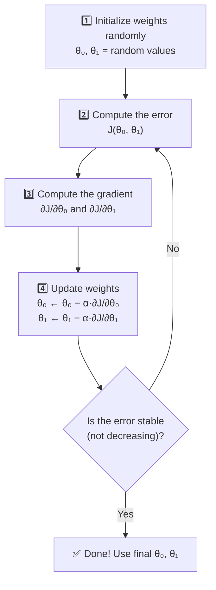
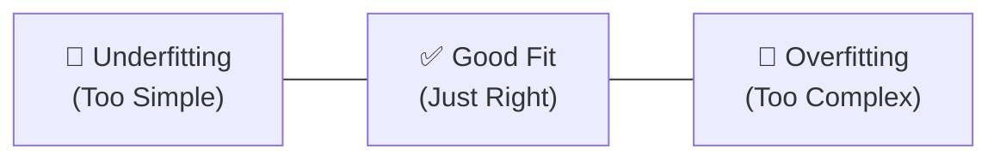

# 📘 Week 2 Study Notes: Linear Regression

> **Course:** COS30082 — Applied Machine Learning
> **Topic:** Linear Regression
> **Prerequisite:** Week 1 (Basics of ML)

---

## Table of Contents

1. [What is a Regression Problem?](#1-what-is-a-regression-problem)
2. [Introduction to Linear Regression](#2-introduction-to-linear-regression)
3. [Simple Linear Regression](#3-simple-linear-regression)
4. [Optimization Method 1: Ordinary Least Squares (OLS)](#4-optimization-method-1-ordinary-least-squares-ols)
5. [The Normal Equation](#5-the-normal-equation)
6. [Optimization Method 2: Gradient Descent](#6-optimization-method-2-gradient-descent)
7. [Normal Equation vs Gradient Descent](#7-normal-equation-vs-gradient-descent)
8. [How the Learning Rate Affects Training](#8-how-the-learning-rate-affects-training)
9. [Multiple Linear Regression](#9-multiple-linear-regression)
10. [Polynomial Regression](#10-polynomial-regression)
11. [Overfitting and Underfitting](#11-overfitting-and-underfitting)
12. [Regularization](#12-regularization)
13. [Ridge Regression (L2 Regularization)](#13-ridge-regression-l2-regularization)
14. [Lasso Regression (L1 Regularization)](#14-lasso-regression-l1-regularization)
15. [Preview: What Comes Next (Logistic Regression)](#15-whats-next-logistic-regression)
16. [Key Takeaways](#16-key-takeaways)
17. [Glossary](#17-glossary)

---

## 1. What is a Regression Problem?

### Simple Explanation

A **regression problem** is when you want the machine to predict a **continuous number** — a value that can be any real number on a sliding scale.

### Regression vs. Classification (Quick Recap)

| | Regression | Classification |
|---|---|---|
| **Output type** | A continuous number (e.g., 45.8, 101.5) | A discrete category (e.g., "boy", "girl") |
| **Question it answers** | "How much?" or "How many?" | "Which one?" or "What type?" |
| **Example** | Predicting someone's weight: **60 kg** | Predicting someone's gender: **boy** or **girl** |

### Examples

**Regression problems (predicting numbers):**

<p align="center">
  
</p>

- What is the **price** of this house? → $450,000
- What is the **age** of this person? → 32 years old
- What is the **weight** of this fish? → 4.5 kg

**NOT regression problems (these are classification):**

<table align="center">
<tr>

<td align="center" valign="top">
  <div align="center">
    
  </div>
</td>

<td width="40"></td>

<td align="center" valign="top">
  <div align="center">
    
  </div>
</td>

</tr>
</table>

- Is this person a boy or a girl? → "boy" (a category)
- Is this email spam? → "yes" or "no" (a category)

> [!NOTE]
> **How to tell the difference:** If the answer is a **number you could put on a number line**, it's regression. If the answer is a **label/category you pick from a list**, it's classification.

---

## 2. Introduction to Linear Regression

### What is Linear Regression?

**Linear Regression** is a supervised learning algorithm that finds the **straight line** (or flat surface) that best describes the relationship between **a dependent, $y$** and **one or more independent, $x$** variables.

### Key Concepts

| Term | Symbol | Meaning | Example |
|------|--------|---------|---------|
| **Independent variable** | $x$ | The input (what you know) | Height of a fish |
| **Dependent variable** | $y$ | The output (what you want to predict) | Width of the fish |
| **Linear relationship** | — | As $x$ increases, $y$ increases (or decreases) proportionally | Taller fish tend to be wider |

### Analogy

<p align="center">
  
</p>

> The heights and weights of your classmates on a graph are plotted graphically. Notice that taller people tend to weigh more ~~(yes it's me)~~. **Linear regression draws the best fit straight line** through all those dots. Once you have that line, you can predict: *"If Sharon is 180 cm tall, she probably weighs about 108 kg."*

### Two Types of Linear Regression

| Type | Number of Inputs | Equation |
|------|-----------------|----------|
| **Simple** Linear Regression | One input variable ($x$) | $h_\theta(x) = \theta_0 + \theta_1 x$ |
| **Multiple** Linear Regression | Two or more input variables ($x_1, x_2, \ldots$) | $h_\theta(x) = \theta_0 + \theta_1 x_1 + \theta_2 x_2 + \ldots$ |

---

## 3. Simple Linear Regression

### What It Is

**Simple Linear Regression (SLR)** is a one-to-one statistical technique that handles **only ONE input feature** (independent variables, $x$) to predict one dependent output ($y$ variable).

<p align="center">
  
</p>

<p align="center">
  <em>1 independent variable (IV) to 1 dependent variable (DV) relationship</em>
</p>

### The Equation

The core equation of simple linear regression is:

$$h_\theta(x) = \theta_0 + \theta_1 x$$

Following the slope-intercept form:

$$\boxed{\underbrace{h_\theta(x)}_{y}=\underbrace{\theta_1}_{m}x+\underbrace{\theta_0}_{c}}$$

where:
| Symbol | Equivalent | Name | What It Represents | Analogy |
|--------|------------|------|--------------------|---------|
| $h_\theta(x)$ | $y$ | Hypothesis function | The predicted output (dependent variable) | Your model's best prediction or best-fit line |
| $\theta_0$ | $c$ | Bias (y-intercept) | Where the line crosses the y-axis | The "starting point" of the line |
| $\theta_1$ | $m$ | Weight (slope/gradient) | How much the prediction changes for every unit increase in $x$ | The "steepness" of the line |
| $x$ | $x$ | Input feature/value | The independent variable used to make predictions | The value you measure or provide |

### Real-World Example: Fish Dimensions

A biologist studies **sea bream fish** and collects data on their height ($x$) and width ($y$):

<p align="center">
  
</p>

<div align="center">

| Height ($x$) | Width ($y$) |
|:------------:|:-----------:|
| 11.52 | 4.02 |
| 12.48 | 4.31 |
| 12.38 | 4.70 |
| 12.73 | 4.46 |
| 12.44 | 5.13 |

</div>

<p align="center">
  
</p>

When plotted, these points show a **positive relationship**: as height increases, width also tends to increase.

### Using the Trained Model

<p align="center">
  
</p>

Suppose the algorithm finds the solution where $\theta_0 = 0.261$ and $\theta_1 = 0.340$, you can now predict the width of a fish with height $x = 15$:

$$h_\theta(15) = 0.261 + 0.340 \times 15 = 0.261 + 5.1 = 5.361$$

**Prediction:** A fish with height 15 has an estimated width of **5.361**.

### The Big Question

**How do we find the best values for $\theta_0$ and $\theta_1$?**

That's what the optimization methods below are for! There are two main approaches:
1. **Ordinary Least Squares (OLS)** — a direct formula
2. **Gradient Descent** — an iterative process

---

## 4. Optimization Method 1: Ordinary Least Squares (OLS)

### The Goal

We want to find the line that is **closest to all the data points.** But what does "closest" mean mathematically?

### The Cost Function (Least Squares)

We measure how "wrong" our line is by calculating the **sum of squared errors** — the total squared distance between each actual data point and the predicted data point on the line:

$$J(\theta_0, \theta_1) = \sum_{n=1}^{N} \left( y^{(n)} - h_\theta(x^{(n)}) \right)^2 = \sum_{n=1}^{N} \left( y^{(n)} - (\theta_0 + \theta_1 x^{(n)}) \right)^2$$

### Breaking This Down

For each data point:
1. **Predict** the output using the current line: $h_\theta(x^{(n)}) = \theta_0 + \theta_1 x^{(n)}$
2. **Calculate the error** (residual): $y^{(n)} - h_\theta(x^{(n)})$ — the gap between actual and predicted
3. **Square it** to make all errors positive: $(y^{(n)} - h_\theta(x^{(n)}))^2$
4. **Sum up** all the squared errors across all $N$ data points

### Worked Example

Suppose we have 3 data points and our current line predicts:

| Point | Actual $y$ | Predicted $h_\theta(x)$ | Error | Squared Error |
|-------|-----------|----------------------|-------|--------------|
| 1 | 4.0 | 3.5 | 0.5 | 0.25 |
| 2 | 5.0 | 5.2 | −0.2 | 0.04 |
| 3 | 6.0 | 5.5 | 0.5 | 0.25 |
| | | | **Total** $J$ = | **0.54** |

We want to find $\theta_0$ and $\theta_1$ that make $J$ as **small as possible**.

### Why Squared?

> Why not just add up the raw errors? Because positive errors (+0.5) and negative errors (−0.5) would cancel each other out! A line that's wildly wrong in both directions could appear "perfect" if the errors cancel. Squaring ensures all errors are positive.

### The Convex Bowl Shape

<p align="center">
  
</p>

The cost function $J(\theta_0, \theta_1)$ forms a **bowl shape** (convex function). This is great news because:
- There is exactly **one global minimum** (one lowest point)
- No matter where you start, you can always find the best answer
- There are no "false bottoms" (local minima) to get stuck in
  
### Solving with Calculus

To find the minimum, we take partial derivatives and set them to zero:

$$\frac{\partial J}{\partial \theta_0} = 0 \quad \text{and} \quad \frac{\partial J}{\partial \theta_1} = 0$$

After solving (the calculus is done for you), we get:

$$\theta_0 = \frac{1}{N} \left[ \sum_{n=1}^{N} y^{(n)} - \theta_1 \sum_{n=1}^{N} x^{(n)} \right]$$

$$\theta_1 = \frac{N \sum_{n=1}^{N} x^{(n)} y^{(n)} - \sum_{n=1}^{N} x^{(n)} \sum_{n=1}^{N} y^{(n)}}{N \sum_{n=1}^{N} x^{(n)})^2 - \left(\sum_{n=1}^{N} x^{(n)}\right)^2}$$

> [!NOTE]
> You don't need to memorize these formulas! The key idea is: **OLS gives you a direct, one-step formula to compute the best parameters.** No iteration needed.

### Worked Numerical Example

Given 3 data points: $(1, 2)$, $(2, 4)$, $(3, 5)$

**Step 1: Compute the needed sums** ($N = 3$)

| | Value |
|---|---|
| $\sum x^{(n)}$ | $1 + 2 + 3 = 6$ |
| $\sum y^{(n)}$ | $2 + 4 + 5 = 11$ |
| $\sum x^{(n)} y^{(n)}$ | $(1)(2) + (2)(4) + (3)(5) = 2 + 8 + 15 = 25$ |
| $\sum (x^{(n)})^2$ | $1 + 4 + 9 = 14$ |

**Step 2: Calculate $\theta_1$**

$$\theta_1 = \frac{3(25) - (6)(11)}{3(14) - (6)^2} = \frac{75 - 66}{42 - 36} = \frac{9}{6} = 1.5$$

**Step 3: Calculate $\theta_0$**

$$\theta_0 = \frac{1}{3}[11 - 1.5 \times 6] = \frac{1}{3}[11 - 9] = \frac{2}{3} \approx 0.667$$

**Result:** $h_\theta(x) = 0.667 + 1.5x$

**Verify:** For $x = 2$: $h_\theta(2) = 0.667 + 1.5(2) = 3.667$ (actual = 4, close enough!)

---

## 5. The Normal Equation

### A Cleaner Way to Write OLS

When you have many features, writing out individual partial derivatives becomes messy. That's when **Normal Equation** comes into handy: packages everything into one elegant matrix formula:

$$\theta = (X^T X)^{-1} X^T y$$

| Symbol | What It Is | Dimensions |
|--------|-----------|------------|
| $\theta$ | Vector of all parameters to learn | $(M+1) \times 1$ |
| $X$ | Matrix of all input data (with a column of 1s for $\theta_0$) | $N \times (M+1)$ |
| $X^T$ | Transpose of $X$ | $(M+1) \times N$ |
| $y$ | Vector of all actual outputs | $N \times 1$ |
| $N$ | Number of training examples | — |
| $M$ | Number of features (independent variables) | — |

### How to Set Up $X$ and $y$

For simple linear regression with data $(x_1, y_1), (x_2, y_2), (x_3, y_3)$:

<p align="center">
  
</p>

### Analogy

> The Normal Equation is like a **magic calculator** — you plug in all your data, press "compute," and it gives you the perfect answer in one step. No guessing, no iteration.

---

## 6. Optimization Method 2: Gradient Descent

### What is Gradient Descent?

**Gradient Descent** is an iterative algorithm that finds the minimum of the cost function by **taking small steps downhill.**

Unlike OLS (which gives you the answer directly), Gradient Descent **gradually improves** the parameters over many iterations.

### The Cost Function (Slightly Different)

For Gradient Descent, we use the **Mean Squared Error (MSE)**, which normalizes by $2N$:

$$J(\theta_0, \theta_1) = \frac{1}{2N} \sum_{n=1}^{N} \left( h_\theta(x^{(n)}) - y^{(n)} \right)^2$$

> The $\frac{1}{2N}$ factor is for mathematical convenience — it makes the derivative cleaner.

### The Analogy: Hiking Down a Mountain in Fog

Imagine you're standing on a mountain in dense fog. You can't see the bottom, but you want to get there. What do you do?

1. **Feel the ground around you** to determine which direction is steepest downhill (compute the gradient)
2. **Take a small step** in that direction (update the parameters)
3. **Repeat** until you reach the bottom (the minimum)

The size of your step is called the **learning rate** ($\alpha$).

### The Update Rule

At each step, update the parameters simultaneously:

$$\theta_0 \leftarrow \theta_0 - \alpha \frac{\partial J}{\partial \theta_0}$$

$$\theta_1 \leftarrow \theta_1 - \alpha \frac{\partial J}{\partial \theta_1}$$

| Component | What It Does |
|-----------|-------------|
| $\theta_j$ | Current parameter value |
| $\alpha$ | Learning rate — how big each step is |
| $\frac{\partial J}{\partial \theta_j}$ | The gradient — the direction and steepness of the slope |
| Minus sign $(-)$ | We go in the **opposite** direction of the gradient (downhill, not uphill) |

### Step-by-Step Algorithm



<p align="center">
  
</p>

<p align="center">
  
</p>

### Why the Gradient Tells You the Right Direction

<p align="center">
  <em>Visual representation on how gradient descent works</em>
</p>

<p align="center">
  
</p>

The gradient ($\frac{\partial J}{\partial \theta}$) tells you **both the direction and the steepness** of the slope:

| Gradient | What It Means | What Happens |
|----------|-------------|-------------|
| **Positive** | You're on the right side of the bowl (slope goes up to the right) | $\theta$ **decreases** (moves left toward minimum) |
| **Negative** | You're on the left side of the bowl (slope goes down to the right) | $\theta$ **increases** (moves right toward minimum) |
| **Zero** | You're at the bottom! | $\theta$ stays put — you've converged! |

### Critical Rule: Simultaneous Updates

Parameters must be updated **simultaneously**, not one-at-a-time:

**✅ Correct (Simultaneous):**
```
tmp0 ← θ₀ − α · ∂J/∂θ₀    // compute both first
tmp1 ← θ₁ − α · ∂J/∂θ₁
θ₀ ← tmp0                   // then update both
θ₁ ← tmp1
```

**❌ Wrong (Sequential):**
```
tmp0 ← θ₀ − α · ∂J/∂θ₀
θ₀ ← tmp0                   // updating θ₀ first changes
tmp1 ← θ₁ − α · ∂J/∂θ₁     // the gradient calculation for θ₁!
θ₁ ← tmp1
```

> [!WARNING]
> If you update $\theta_0$ before computing the gradient for $\theta_1$, the second gradient is computed using the **already-changed** $\theta_0$, which gives a wrong direction. Always compute all gradients first, then update all parameters together.

---

## 7. Normal Equation vs Gradient Descent

### When to Use Which?

| Aspect | Normal Equation | Gradient Descent |
|--------|----------------|-----------------|
| **Approach** | Direct calculation (one step) | Iterative (many steps) |
| **Learning rate** | Not needed ✅ | Must be tuned ⚠️ |
| **Iterations** | None — single computation | Many iterations needed |
| **Speed with few features** ($M < 1000$) | Fast ✅ | Slower |
| **Speed with many features** ($M > 10000$) | Very slow ❌ | Still efficient ✅ |
| **Matrix inversion** | Requires $(X^T X)^{-1}$ — expensive! | Not needed ✅ |
| **Non-invertible $X^T X$** | Fails if features are redundant | Still works ✅ |

### Rule of Thumb

> - **Few features** (up to hundreds or low thousands): Use the **Normal Equation** — faster, no hyperparameters
> - **Many features** (thousands to millions): Use **Gradient Descent** — scales much better

---

## 8. How the Learning Rate Affects Training

The **learning rate** ($\alpha$) controls the step size:

| Learning Rate | Effect | Easier Representation |
|---|---|---|
| **🐢 Too small** | Takes forever to reach the minimum — very slow convergence | Slow but safe |
| **✅ Just right** | Reaches the minimum efficiently | Fast and stable |
| **🚀 Too large** | Overshoots the minimum, bounces around, may never converge (loss explodes!) | Fast but unstable |

<table align="center">
<tr>

<td align="center" width="33%">


<br>

### **Too Small**
**Learning Rate:** α = **0.001**

Tiny updates are made in each iteration, causing the model to converge very slowly and requiring many iterations to reach the minimum.

</td>

<td align="center" width="33%">


<br>

### **Just Right**
**Learning Rate:** α = **0.1**

The model takes balanced step sizes, converging smoothly and efficiently toward the global minimum without overshooting.

</td>

<td align="center" width="33%">


<br>

### **Too Large**
**Learning Rate:** α = **1.0**

The updates are excessively large, causing the model to overshoot the minimum repeatedly. Training may oscillate or even diverge instead of converging.

</td></tr></table>

> [!TIP]
> **Practical advice:** Start with a learning rate of **0.01** or **0.001**. If training is too slow, increase it. If the loss is exploding (going up instead of down), decrease it. Common values: 0.001, 0.01, 0.1.

---

## 9. Multiple Linear Regression

### What It Is

**Multiple Linear Regression (MLR)** is a many-to-one statistical technique that extends simple linear regression to handle **multiple input features** (independent variables, $x$) to predict one dependent output ($y$ variable).

<p align="center">
  
</p>

<p align="center">
  <em>3 independent variables (IV) to 1 dependent variable (DV) relationship</em>
</p>

Instead of one $x$, you have $x_1, x_2, \ldots, x_M$.

### The Equation

$$h_\theta(x) = \theta_0 x_0 + \theta_1 x_1 + \theta_2 x_2 + \ldots + \theta_M x_M$$

where $x_0 = 1$ (a constant, so that $\theta_0$ acts as the bias/intercept).

### Real-World Example: Fish Width Prediction

<p align="center">
  
</p>

Instead of using only **height** to predict width, we use diagonal length, total length, body height and weight as multiple input features (independent variables, $x_M$):

<div align="center">
  
| Feature | Variable | Example Value |
|---------|----------|---------------|
| Height | $x_1$ | 11.52 |
| Diagonal Length | $x_2$ | 30.0 |
| Total Length | $x_3$ | 25.4 |
| Body Height | $x_4$ | 23.2 |
| Weight | $x_5$ | 242 |
| **Width (output)** | **$y$** | **4.02** |
  
</div>

The hypothesis becomes:

$$h_\theta(x) = \theta_0 + \theta_1 x_1 + \theta_2 x_2 + \theta_3 x_3 + \theta_4 x_4 + \theta_5 x_5$$

### Analogy

> Simple linear regression is like predicting your exam score using **only** the number of hours you studied. Multiple linear regression is like predicting it using number of hours studied, hours of sleep, number of practice questions done **AND** attendance rate. The more the information, the better the prediction is!

### Important Assumption

> [!IMPORTANT]
> MLR assumes the independent variables are **not too highly correlated** with each other. For example, height ($x_1$) and weight ($x_5$) should not be too strongly correlated. If they are, the model becomes unstable.

### Optimization

The same two methods work for MLR:

**Normal Equation:**
$$\theta = (X^T X)^{-1} X^T y$$
where $X$ is a $N \times (M+1)$ matrix and $y$ is a $N \times 1$ matrix.

**Gradient Descent:**
$$\theta_j \leftarrow \theta_j - \alpha \frac{\partial J}{\partial \theta_j} \quad \text{for } j = 0, 1, \ldots, M$$

All $\theta_j$ values are updated simultaneously for each iteration.

---

## 10. Polynomial Regression

### The Problem: What If the Data Isn't Linear?

Sometimes, a straight line simply **can't capture** the relationship between $x$ and $y$. The data might curve!

### Example

<div align="center">
  
| $x$ | $y$ |
|-----|------|
| 0.368 | 0.667 |
| 0.401 | 0.792 |
| 0.434 | 1.247 |
| 0.468 | 0.563 |
| 0.502 | 1.792 |

</div>

If you plot this data, a straight line ($h_\theta(x) = \theta_0 + \theta_1 x$) would be a poor fit as attached on the diagram below.

<p align="center">
  
</p>

<p align="center">
  <em>Poor line fit</em>
</p>

### The Solution: Add Polynomial Terms

Instead of fitting a straight line, we fit a **curve** by adding powers of $x$:

| Degree | Equation | Shape |
|--------|----------|-------|
| 1 (Linear) | $h_\theta(x) = \theta_0 + \theta_1 x$ | Straight line |
| 2 (Quadratic) | $h_\theta(x) = \theta_0 + \theta_1 x + \theta_2 x^2$ | Parabola (U-shape) |
| 3 (Cubic) | $h_\theta(x) = \theta_0 + \theta_1 x + \theta_2 x^2 + \theta_3 x^3$ | S-curve |
| 4 (Quartic) | $h_\theta(x) = \theta_0 + \theta_1 x + \theta_2 x^2 + \theta_3 x^3 + \theta_4 x^4$ | More complex curve |
| $M$ | $h_\theta(x) = \theta_0 + \theta_1 x + \theta_2 x^2 + \ldots + \theta_M x^M$ | Very flexible curve |

<p align="center">
  
</p>

<p align="center">
  <em>Adding powers of x to fit the best curve</em>
</p>

### The Clever Trick: It's Still "Linear" Regression!

Polynomial regression is actually a **special case of multiple linear regression.** Here's why:

Replace $x^2$ with a new variable $x_2$, and $x^3$ with $x_3$, etc.:

$$h_\theta(x) = \theta_0 + \theta_1 x + \theta_2 x^2 + \theta_3 x^3$$

...is the same as:

$$h_\theta(x) = \theta_0 + \theta_1 x_1 + \theta_2 x_2 + \theta_3 x_3$$

where $x_1 = x$, $x_2 = x^2$, $x_3 = x^3$.

<p align="center">
  
</p>

The model is **linear in the parameters** ($\theta_0, \theta_1, \theta_2, \theta_3$) even though it's nonlinear in $x$. This means we can use the same OLS/Gradient Descent methods!

### Example Data Transformation

| Original $x$ | $x_1 = x$ | $x_2 = x^2$ | $y$ |
|---|---|---|---|
| 0.368 | 0.368 | 0.135 | 0.667 |
| 0.401 | 0.401 | 0.161 | 0.792 |
| 0.434 | 0.434 | 0.188 | 1.247 |

Now you can apply multiple linear regression with two features ($x_1$ and $x_2$)!

> [!TIP]
> **Higher degree → more flexibility.** A degree-5 polynomial can fit very complex curves. But be careful: too much flexibility leads to **overfitting** (next section).

---

## 11. Overfitting and Underfitting

### The Two Extremes

These are the two most important problems in machine learning:



<table align="center">

<tr>

<td align="center" width="33%">

<h3>🔵 Underfitting</h3>

<b>📋 Training Summary at Degree = 1</b><br>


<br><br>

<b>📈 Regression Model</b><br>


<br><br>

<b>📉 Learning Curve</b><br>


<br><br>
The model is too simple to capture the nonlinear relationship in the data. Both the training and testing errors remain relatively high, indicating high bias and poor generalization.

</td>

<td align="center" width="33%">

<h3>🟢 Good Fit</h3>

<b>📋 Training Summary at Degree = 3</b><br>


<br><br>

<b>📈 Regression Model</b><br>


<br><br>

<b>📉 Learning Curve</b><br>


<br><br>
The model successfully captures the underlying trend while maintaining good generalization. Training and testing errors decrease together and remain close.

</td>

<td align="center" width="33%">

<h3>🔴 Overfitting</h3>

<b>📋 Training Summary at Degree = 19</b><br>


<br><br>

<b>📈 Regression Model</b><br>


<br><br>

<b>📉 Learning Curve</b><br>


<br><br>
The model memorizes the training data, resulting in very low training error but significantly higher testing error due to poor generalization.

</td>

</tr>

</table>

### Summary Table between Underfitting, Good Fit, and Overfitting

| Aspect | 🔵 Underfitting | 🟢 Good Fit | 🔴 Overfitting |
|--------|-----------------|------------|----------------|
| **What it is** | Model is too simple to capture the underlying pattern | Model captures the general pattern without memorizing the data | Model is too complex and memorizes the training data instead of learning general patterns |
| **Training Performance** | Poor | Good | Excellent |
| **Testing Performance** | Poor | Good | Poor |
| **Bias** | High | Moderate | Low |
| **Variance** | Low | Moderate | High |
| **Common Cause** | Model complexity is too low | Appropriate model complexity | Too many parameters or insufficient training data |
| **Example** | Fitting a straight line to nonlinear data | Fitting a smooth curve that follows the trend | A high-degree polynomial that passes through every training point |
| **Typical Solution** | Increase model complexity or add more features | Maintain the current model | Simplify the model, apply regularization, or collect more data |

### Analogy

> **Underfitting** is like a student who reads one chapter and takes the exam — they didn't study enough.
>
> **Overfitting** is like a student who memorizes every answer in the practice exam word-for-word. They score 100% on the practice exam, but fail the real exam because the questions are slightly different. They memorized instead of understanding.
>
> **Good fit** is like a student who understands the concepts and can apply them to new questions they've never seen before.

### How to Overcome Overfitting

| Method | How It Works |
|--------|-------------|
| **Manual feature selection** | Remove the unimportant features by yourself |
| **Model selection** | Try simpler models and pick the best one |
| **Regularization** | Add a penalty for large weights (see next section!) |
| **Collect more training data** | Give the model more examples to learn from |

---

## 12. Regularization

### What Is Regularization?

**Regularization** is a technique that prevents a model from overfitting by **penalizing large weight values.** 

### What's good about it
- encourages simple models like Lasso (L1), Ridge (L2), and Elastic Net
- helps the model to generalize better to new, unseen data instead of memorizing noises in the training set
  
### Why It Works

An overfit model typically has **very large weights** ($\theta_j$). These large weights cause the model to react dramatically to small changes in input, creating the wild wiggles you see in high-degree polynomials.

Regularization says: *"You can fit the data, but keep your weights small!"*

### The Two Main Types

| Type | Name | Regularization Term | What It Does |
|------|------|-------------------|-------------|
| **L2** | Ridge Regression | $\lambda \sum_{j=1}^{M} \theta_j^2$ | Shrinks weights toward zero (but never exactly zero) |
| **L1** | Lasso Regression | $\lambda \sum_{j=1}^{M} \lvert \theta_j \rvert$ | Forces some weights to become exactly zero, effectively performs feature selection |

---

## 13. Ridge Regression (L2 Regularization)

### The Regularized Cost Function

$$J(\theta) = \frac{1}{2N} \left[ \sum_{n=1}^{N} (h_\theta(x^{(n)}) - y^{(n)})^2 + \lambda \sum_{j=1}^{M} \theta_j^2 \right]$$

### Understanding the Cost Function

| Component | Mathematical Expression | What It Means | Goal |
|-----------|-------------------------|---------------|------|
| **① The First Term**<br>*(Original Cost)* | $\sum_{n=1}^{N}(h_\theta(x^{(n)})-y^{(n)})^2$ | Measures how far the model's predictions are from the actual target values. This is the **Mean Squared Error (MSE)**. | Minimizes prediction error so the model fits the training data accurately. |
| **② The Second Term**<br>*(Regularization Penalty)* | $\lambda\sum_{j=1}^{M}\theta_j^2$ | Penalizes large model weights by adding an extra cost. This encourages the model to learn simpler and more stable parameters. | Keeps weights small to reduce overfitting and improve generalization. |
| **🎛️ The Control Knob**<br>*(Regularization Parameter)* | $\lambda$ | Controls regularization penalty strength that will affect the total cost function. | Balance model accuracy and model simplicity. |

> [!NOTE]
> The cost function has **two competing objectives**:
> - **Fit the training data accurately** by minimizing the prediction error (First Term).
> - **Keep the model simple** by preventing excessively large weights (Second Term).
>
> The regularization parameter **λ** acts like a **control knob**, determining the balance between these two objectives.

### 🎛️ What Happens When λ Changes?

| $\lambda$ Value | Effect | Risk |
|---|---|---|
| $\lambda = 0$ | No regularization at all — same as unregularized regression | Potential overfitting |
| $\lambda$ too small | Very weak regularization — barely affects the model | Still overfits |
| $\lambda$ just right | Good balance between fitting data and keeping weights small | ✅ Best model |
| $\lambda$ too large | Forces nearly all weights to zero — model becomes too simple | **Underfitting!** |

### Let's take a visual example!

Consider $h_\theta(x) = \theta_0 + \theta_1 x + \theta_2 x^2 + \theta_3 x^3$:

<table align="center">
<tr>

<td align="center" width="33%">


<br>

**Case 1: Without regularization**

</td>

<td align="center" width="33%">


<br>

**Case 2: Right $\lambda$**

</td>

<td align="center" width="33%">


<br>

**Case 3: $\lambda$ too large**

</td>

</tr>
</table>

| Scenario | What Happens | Result |
|---|---|---|
| **No regularization** ($\lambda = 0$) | $\theta_2$ and $\theta_3$ can be large | Complex, wiggly curve (overfitting) |
| **Right $\lambda$** | $\theta_2$ and $\theta_3$ are shrunk but nonzero | Smooth curve (good fit) |
| **$\lambda$ too large** | $\theta_1, \theta_2, \theta_3 \approx 0$ | Nearly flat line: $h \approx \theta_0$ (underfitting) |

### Gradient Descent with L2 Regularization

The weight update becomes:

$$\theta_j \leftarrow \theta_j \left(1 - \alpha \frac{\lambda}{N}\right) - \alpha \left[\frac{1}{N} \sum_{n=1}^{N} (h_\theta(x^{(n)}) - y^{(n)}) \cdot x_j^{(n)} \right]$$

Notice the term $(1 - \alpha \frac{\lambda}{N})$ — it **shrinks** $\theta_j$ slightly at every step. This is why L2 regularization is also called **weight decay**.

> [!NOTE]
> The bias term $\theta_0$ is typically **NOT regularized**. Regularization only applies to $\theta_1, \theta_2, \ldots, \theta_M$.

---

## 14. Lasso Regression (L1 Regularization)

### The Regularized Cost Function

$$J(\theta) = \frac{1}{2N} \left[ \sum_{n=1}^{N} (h_\theta(x^{(n)}) - y^{(n)})^2 + \lambda \sum_{j=1}^{M} |\theta_j| \right]$$

The only difference from Ridge is using $|\theta_j|$ (absolute value) instead of $\theta_j^2$.

### What Makes Lasso Special?

**Lasso can shrink weights all the way to exactly zero,** effectively removing features from the model. This means Lasso can perform **automatic feature selection!**

### Ridge vs Lasso Comparison

| Aspect | Ridge (L2) | Lasso (L1) |
|--------|-----------|-----------|
| Regularization term | $\lambda \sum \theta_j^2$ | $\lambda \sum_{j=1}^{M} \lvert \theta_j \rvert$ |
| Weight shrinkage | Shrinks weights toward zero but **never exactly zero** | Can shrink weights **to exactly zero** |
| Feature selection | No — keeps all features | Yes — removes unimportant features |
| Best for | When all features contribute somewhat | When you suspect many features are irrelevant |

### Gradient Descent with L1 Regularization

The derivative of $|\theta_j|$ depends on the sign of $\theta_j$:

$$\frac{d|\theta_j|}{d\theta_j}=\begin{cases}1, & \text{if } \theta_j > 0 ; -1, & \text{if } \theta_j < 0\end{cases}$$

**When $\theta_j > 0$:** 
$$\theta_j \leftarrow \theta_j - \alpha \frac{\lambda}{N} - \alpha \left[\frac{1}{N} \sum_{n=1}^{N} (h_\theta(x^{(n)}) - y^{(n)}) \cdot x_j^{(n)} \right]$$

**When $\theta_j < 0$:** 
$$\theta_j \leftarrow \theta_j + \alpha \frac{\lambda}{N} - \alpha \left[\frac{1}{N} \sum_{n=1}^{N} (h_\theta(x^{(n)}) - y^{(n)}) \cdot x_j^{(n)} \right]$$

### Analogy
> Imagine the ETS project consists of four members namely: Sharon, Henry, Ivan and Mark.
> 
> #### 🟦 L2 Regularization — Everyone Stays
> 
> Initially, Sharon is doing most of the work while the others contribute less.
>
> **Before balancing**
>
> - Sharon: **50%**
> - Henry: **25%**
> - Ivan: **15%**
> - Mark: **10%**
>
> Sir Almon, the project leader decides that no one person should carry most of the project ~~(and ensure everyone gets to secure jobs :D）~~.
>
> **After balancing/reducing**
>
> - Sharon: **35%**
> - Henry: **25%**
> - Ivan: **20%**
> - Mark: **20%**
>
> Everyone stays in the team, but the workload becomes more evenly distributed.
> **In machine learning:** all features remain, but their weights are reduced.
> 
> #### 🟥 L1 Regularization — Sack the Non-Contributors
>
> Sir Almon decides to **sack teammates who aren't or didn't contribute enough** so that only the most valuable contributors remain.
> Out of ⭐⭐⭐⭐⭐, which one of these teammates are well-performing? With ⭐⭐⭐⭐⭐ being the hard worker and ⭐ being the slacker?
> - 👩 Sharon ⭐⭐⭐⭐⭐
> - 👨 Henry  ⭐⭐⭐⭐ ☆
> - 🧔‍♂️ Ivan   ⭐ ☆ ☆ ☆ ☆
> - 👨‍🦱 Mark   ⭐ ☆ ☆ ☆ ☆
>
> The project manager decides to sack the teammates who contributed very little.
>
> **Remaining team**
> ✅ Sharon
> ✅ Henry
> ~~❌ Ivan~~
> ~~❌ Mark~~
>
> **🧠 Machine Learning:** Features with little importance have their weights reduced to **exactly zero**, effectively removing them from the model.
>
> **💡 Memory Trick:**  
> - **L2:** Everyone stays, but everyone's influence is reduced.
> - **L1:** Sack the teammates who contribute the least.
---

## 15. What's Next (Logistic Regression)

Linear regression predicts **continuous numbers**, but what if you want to predict **categories**?

For example: Is this person **happy** or **not happy**? ($y = 1$ or $y = 0$?)

If you try using linear regression for this, the predicted values could go below 0 or above 1, which doesn't make sense for a probability.

**Logistic Regression** solves this by using a special S-shaped curve (sigmoid function) that squashes predictions into the range $[0, 1]$.

<p align="center">
  
</p>

<p align="center">
  
</p>

---

## 16. Key Takeaways

> [!IMPORTANT]
> **The 12 things to remember from Week 2:**

1. **Regression** predicts continuous numbers; **classification** predicts categories
2. **Simple linear regression**: $h_\theta(x) = \theta_0 + \theta_1 x$ — a straight line
3. $\theta_0$ is the **bias** (intercept), $\theta_1$ is the **weight** (slope)
4. The **cost function** measures how wrong the model is: $J = \sum (y - h_\theta(x))^2$
5. **OLS** solves for the best parameters directly using calculus
6. The **Normal Equation** ($\theta = (X^T X)^{-1} X^T y$) is a matrix shortcut for OLS
7. **Gradient Descent** iteratively adjusts weights by walking downhill on the cost surface
8. The **learning rate** ($\alpha$) must be tuned: too small = slow, too large = diverges
9. **Multiple Linear Regression** uses many input features ($x_1, x_2, \ldots$)
10. **Polynomial Regression** adds $x^2, x^3, \ldots$ terms for curved relationships — it's a special case of MLR
11. **Overfitting** = model too complex (memorizes data); **Underfitting** = model too simple (misses patterns)
12. **Regularization** prevents overfitting: **Ridge (L2)** shrinks weights; **Lasso (L1)** can eliminate features entirely

---

## 17. Glossary

| Term | Definition |
|------|-----------|
| **Bias ($\theta_0$)** | The intercept term — the predicted value when all inputs are zero |
| **Coefficient ($\theta_j$)** | The weight assigned to input variable $x_j$; determines how much influence $x_j$ has |
| **Convex function** | A bowl-shaped function with a single global minimum; easy to optimize |
| **Cost function $J(\theta)$** | A function that measures the total error of the model; the goal is to minimize it |
| **Dependent variable ($y$)** | The output variable you're trying to predict |
| **Gradient** | The slope of the cost function — tells you the direction and magnitude of the steepest ascent |
| **Gradient Descent** | An iterative optimization algorithm that minimizes the cost function by following the negative gradient |
| **Independent variable ($x$)** | The input variable(s) you use to make predictions |
| **Intercept** | Same as bias ($\theta_0$) — where the line crosses the y-axis |
| **L1 Regularization** | Adds $\lambda \sum |\theta_j|$ to the cost function; can shrink weights to exactly zero |
| **L2 Regularization** | Adds $\lambda \sum \theta_j^2$ to the cost function; shrinks weights toward zero |
| **Lambda ($\lambda$)** | The regularization parameter that controls penalty strength |
| **Lasso Regression** | Linear regression with L1 regularization; performs feature selection |
| **Learning rate ($\alpha$)** | Controls the step size in gradient descent |
| **Least Squares** | A method that minimizes the sum of squared differences between predicted and actual values |
| **Multiple Linear Regression** | Linear regression with two or more independent variables |
| **Normal Equation** | A closed-form matrix formula to solve linear regression: $\theta = (X^T X)^{-1} X^T y$ |
| **Overfitting** | Model fits training data perfectly but fails on unseen data — too complex |
| **Polynomial Regression** | Using powers of $x$ (e.g., $x^2, x^3$) to fit curved relationships |
| **Regularization** | Adding a penalty to the cost function to prevent overfitting |
| **Residual** | The error for a single data point: $y_n - h_\theta(x_n)$ |
| **Ridge Regression** | Linear regression with L2 regularization |
| **Simple Linear Regression** | Linear regression with a single independent variable |
| **Slope** | Same as weight ($\theta_1$) — how much $y$ changes per unit change in $x$ |
| **Underfitting** | Model is too simple to capture patterns in the data |
| **Weight ($\theta_j$)** | A learned parameter that determines the influence of feature $x_j$ |
| **Weight decay** | Another name for L2 regularization; weights are slightly reduced at each update |

---

> [!TIP]
> **Study tip for Week 2:** Make sure you can:
> 1. Write out the simple linear regression equation and label each part
> 2. Explain the difference between OLS and Gradient Descent in your own words
> 3. Work through a gradient descent step by hand (compute gradient, update weight)
> 4. Draw what underfitting, good fit, and overfitting look like on a graph
> 5. Explain why regularization helps prevent overfitting
> 6. Describe the difference between Ridge and Lasso in one sentence
