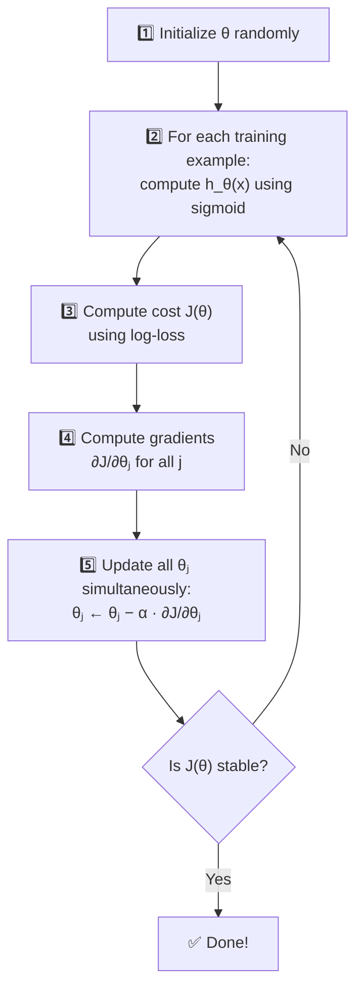

# 📘 Week 3 Study Notes: Logistic Regression

> **Course:** COS30082 — Applied Machine Learning
> **Topic:** Logistic Regression
> **Prerequisite:** Week 2 (Linear Regression)

---

## Table of Contents

1. [Recap: Regression vs Classification](#1-recap-regression-vs-classification)
2. [Why Linear Regression Fails for Classification](#2-why-linear-regression-fails-for-classification)
3. [Introduction to Logistic Regression](#3-introduction-to-logistic-regression)
4. [The Sigmoid Function](#4-the-sigmoid-function)
5. [Interpreting the Output as Probability](#5-interpreting-the-output-as-probability)
6. [Decision Boundaries](#6-decision-boundaries)
7. [Non-Linear Decision Boundaries](#7-non-linear-decision-boundaries)
8. [Linear Regression vs Logistic Regression](#8-linear-regression-vs-logistic-regression)
9. [The Cost Function (Why MSE Doesn't Work)](#9-the-cost-function-why-mse-doesnt-work)
10. [Maximum Likelihood Estimation (MLE)](#10-maximum-likelihood-estimation-mle)
11. [The Log-Loss Cost Function](#11-the-log-loss-cost-function)
12. [Gradient Descent for Logistic Regression](#12-gradient-descent-for-logistic-regression)
13. [Multiclass Classification: One-vs-All](#13-multiclass-classification-one-vs-all)
14. [Multiclass Classification: Multinomial (Softmax)](#14-multiclass-classification-multinomial-softmax)
15. [Gradient Descent Variations](#15-gradient-descent-variations)
16. [Key Takeaways](#16-key-takeaways)
17. [Glossary](#17-glossary)

---

## 1. Recap: Regression vs Classification

From Week 2, we learned that **supervised learning** has two types:

| Type | Output | Example Question | Example Answer |
|------|--------|-----------------|----------------|
| **Regression** | A continuous number | "What is this house's price?" | $450,000 |
| **Classification** | A discrete category | "Is this email spam?" | Yes / No |

**This week** we learn **Logistic Regression** — a classification algorithm. Despite having "regression" in its name, it is used for **classification** problems!

> [!NOTE]
> **Why the confusing name?** Logistic Regression uses regression-like math (fitting a curve) under the hood, but its purpose is to classify data into categories. Think of it as: "regression math used to solve a classification problem."

---

## 2. Why Linear Regression Fails for Classification

### The Idea: What If We Just Use a Straight Line?

Suppose we want to classify patients as **obese** (1) or **non-obese** (0) based on their weight. Could we just use the linear regression line $h_\theta(x) = \theta_0 + \theta_1 x$ from Week 2?

**Attempt:** Draw a straight line through the data, then use a **hard threshold** at 0.5:
- If $h_\theta(x) \geq 0.5$ → predict **obese** (1)
- If $h_\theta(x) < 0.5$ → predict **non-obese** (0)

### Problem 1: Sensitive to Outliers

This seems to work... until new extreme data points show up.

Imagine adding a few extremely heavy obese patients to the data. The linear regression line would **tilt** to accommodate them, shifting the threshold and suddenly **misclassifying** patients who were previously classified correctly!

> **Analogy:** It's like balancing a seesaw. If someone very heavy sits on one end, the whole balance point shifts. One extreme data point can ruin the entire classification.

### Problem 2: Predictions Can Go Outside [0, 1]

Linear regression can predict **any real number** — like −0.3 or 1.7. But for classification:
- A probability can't be negative (what does "−30% chance of being obese" mean?)
- A probability can't be above 1 (what does "170% chance" mean?)

We need a model where predictions are **always between 0 and 1**.

### The Solution: Logistic Regression!

Instead of a straight line, we need an **S-shaped curve** that naturally stays between 0 and 1. This is exactly what the **sigmoid function** provides.

---

## 3. Introduction to Logistic Regression

### What Is It?

**Logistic Regression** is a machine learning algorithm for **classification** that predicts the **probability** that something belongs to a particular class.

| Feature | Description |
|---------|------------|
| **Purpose** | Classification (not regression!) |
| **Output** | A probability between 0 and 1 |
| **Binary classification** | Predicts one of two classes (0 or 1, yes or no, spam or not spam) |
| **Core idea** | Wraps linear regression inside a sigmoid function |

### The Equation

$$h_\theta(x) = \frac{1}{1 + e^{-(\theta_0 + \theta_1 x)}}$$

This is just the linear regression equation ($z = \theta_0 + \theta_1 x$) plugged into the **sigmoid function** ($g(z) = \frac{1}{1 + e^{-z}}$):

$$h_\theta(x) = g(z) \quad \text{where } z = \theta_0 + \theta_1 x$$

---

## 4. The Sigmoid Function

### The Formula

$$g(z) = \frac{1}{1 + e^{-z}}$$

### What It Looks Like

```
  g(z)
  1.0 |                        _______________
      |                      /
  0.5 |· · · · · · · · · · /· · · · · · · · ·
      |                  /
  0.0 |________________/
      +-------|---------|---------|----------→ z
            -5         0         5
```

### Why It's Perfect for Classification

| Property | What It Means | Why It Matters |
|----------|-------------|----------------|
| Output always between 0 and 1 | Never predicts −0.3 or 1.7 | Output can be interpreted as a probability |
| When $z = 0$, output = 0.5 | The "undecided" point | Natural threshold for classification |
| When $z$ is very large (+), output → 1 | Very confident it's class 1 | Strong positive evidence = high probability |
| When $z$ is very negative (−), output → 0 | Very confident it's class 0 | Strong negative evidence = low probability |
| Smooth S-shape | Gradual transition between 0 and 1 | Allows gradient descent to work (differentiable) |

### Worked Example: Computing the Sigmoid

Let's say $\theta_0 = -3$ and $\theta_1 = 1$. For a patient with weight $x = 5$:

**Step 1:** Compute $z$:
$$z = \theta_0 + \theta_1 x = -3 + 1(5) = 2$$

**Step 2:** Plug into sigmoid:
$$g(2) = \frac{1}{1 + e^{-2}} = \frac{1}{1 + 0.135} = \frac{1}{1.135} = 0.881$$

**Interpretation:** There's an **88.1% probability** this patient is obese.

Since $0.881 \geq 0.5$, we predict $y = 1$ (**obese**).

### Another Example: Weight = 2

$$z = -3 + 1(2) = -1$$
$$g(-1) = \frac{1}{1 + e^{1}} = \frac{1}{1 + 2.718} = \frac{1}{3.718} = 0.269$$

**Interpretation:** There's a **26.9% probability** this patient is obese.

Since $0.269 < 0.5$, we predict $y = 0$ (**non-obese**).

### The Decision Rule

| Condition | Equivalent to | Prediction |
|-----------|--------------|------------|
| $h_\theta(x) \geq 0.5$ | $z \geq 0$ | $y = 1$ (positive class) |
| $h_\theta(x) < 0.5$ | $z < 0$ | $y = 0$ (negative class) |

> **Analogy:** Think of the sigmoid as a **dimmer switch**. A regular light switch is binary (on/off), but a dimmer gradually transitions from off (0) to on (1). At the midpoint (0.5), the light is half-on. The sigmoid "dims" smoothly between 0 and 1, giving us a confidence level instead of a hard yes/no.

---

## 5. Interpreting the Output as Probability

### What $h_\theta(x)$ Represents

The output $h_\theta(x)$ is the **probability** that $y = 1$, given input $x$ and parameters $\theta$:

$$h_\theta(x) = P(y = 1 \mid x; \theta)$$

### How to Read It

| $h_\theta(x)$ | In Words |
|----------------|----------|
| $h_\theta(x) = 0.91$ | "There's a **91% probability** this patient is obese" → Predict **obese** |
| $h_\theta(x) = 0.30$ | "There's a **30% probability** this patient is obese" → Predict **non-obese** |
| $h_\theta(x) = 0.50$ | "It's a coin flip — **50/50**" → Right at the decision boundary |

### The Complement Rule

Since there are only two classes, the probabilities must add up to 1:

$$P(y = 0 \mid x; \theta) + P(y = 1 \mid x; \theta) = 1$$

So:
$$P(y = 0 \mid x; \theta) = 1 - h_\theta(x)$$

### Example

If $h_\theta(x) = 0.91$:
- Probability of obese ($y=1$): **91%**
- Probability of non-obese ($y=0$): $1 - 0.91$ = **9%**

> **Analogy:** It's like a weather forecast. When they say "there's a 91% chance of rain," they're also saying there's a 9% chance of no rain. The model gives you this same kind of confidence level.

---

## 6. Decision Boundaries

### What Is a Decision Boundary?

A **decision boundary** is the line (or curve) that separates the data into different classes. On one side of the boundary, the model predicts class 0; on the other side, it predicts class 1.

### Example: Classifying Iris Flowers (1 Feature)

We want to classify two species of Iris flowers — **setosa** ($y = 0$) and **versicolor** ($y = 1$) — based on **sepal length** ($x$):

| Sepal Length ($x$) | Species | Label ($y$) |
|---|---|---|
| 5.1 | setosa | 0 |
| 4.9 | setosa | 0 |
| 6.7 | versicolor | 1 |
| 5.4 | setosa | 0 |
| 6.0 | versicolor | 1 |

After training, suppose we find $\theta_0 = -1.033$ and $\theta_1 = 0.192$.

**Finding the decision boundary:** The boundary is where $h_\theta(x) = 0.5$, which means $z = 0$:

$$\theta_0 + \theta_1 x = 0$$
$$-1.033 + 0.192x = 0$$
$$x = \frac{1.033}{0.192} = 5.38$$

**Result:** The decision boundary is at $x = 5.38$.
- If sepal length $\geq 5.38$ → predict **versicolor** ($y = 1$)
- If sepal length $< 5.38$ → predict **setosa** ($y = 0$)

> **Analogy:** The decision boundary is like the **border between two countries** on a map. If you're on the left side, you're in "setosa land." If you're on the right side, you're in "versicolor land."

### Example: 2 Features (Sepal Length AND Width)

With two features ($x_1$ = sepal length, $x_2$ = sepal width), the decision boundary becomes a **line in 2D space**:

$$z = \theta_0 + \theta_1 x_1 + \theta_2 x_2 = 0$$

Suppose $\theta_0 = -0.588$, $\theta_1 = 0.225$, $\theta_2 = -0.205$. The boundary is:

$$-0.588 + 0.225 x_1 - 0.205 x_2 = 0$$

Rearranging:

$$x_2 = \frac{0.225}{0.205} x_1 - \frac{0.588}{0.205} \approx 1.098 x_1 - 2.868$$

This is a **straight line** on the $x_1$-$x_2$ plot that divides the flowers into two groups.

---

## 7. Non-Linear Decision Boundaries

### When a Straight Line Isn't Enough

Sometimes the two classes are **intertwined** in a way that no straight line can separate them. For example, one class might be in a circle surrounded by the other class.

### Solution: Add Polynomial Features

Just like polynomial regression (Week 2), we can add higher-order features:

| Boundary Shape | Equation | Example |
|---|---|---|
| **Straight line** | $z = \theta_0 + \theta_1 x_1 + \theta_2 x_2$ | Separating cats from dogs by height and weight |
| **Circle / Ellipse** | $z = \theta_0 + \theta_1 x_1 + \theta_2 x_2 + \theta_3 x_1^2 + \theta_4 x_2^2$ | A tumor surrounded by healthy tissue |
| **Complex curves** | $z = \theta_0 + \theta_1 x_1 + \theta_2 x_2 + \theta_3 x_1^2 + \theta_4 x_1^2 x_2 + \theta_5 x_1^2 x_2^2 + \ldots$ | More intricate patterns |

> **Analogy:** A straight decision boundary is like dividing a room with a straight wall. A non-linear boundary is like dividing a room with a curved wall — you can create more complex shapes (circles, waves) to properly separate the groups.

---

## 8. Linear Regression vs Logistic Regression

| Aspect | Linear Regression | Logistic Regression |
|--------|------------------|-------------------|
| **Purpose** | Regression (predict numbers) | Classification (predict categories) |
| **Output** | Any real number (−∞ to +∞) | Probability between 0 and 1 |
| **Shape** | Straight line | S-shaped curve (sigmoid) |
| **Dependent variable ($y$)** | Continuous (e.g., 45.3, 102.7) | Discrete (e.g., 0 or 1) |
| **Requires linear relationship?** | Yes | No |
| **Loss function** | Mean Squared Error (MSE) | Log-Loss (Cross-Entropy) |
| **Example** | Predicting house prices | Classifying email as spam/not spam |

---

## 9. The Cost Function (Why MSE Doesn't Work)

### The Problem

In linear regression, we used **Mean Squared Error (MSE)**:

$$J(\theta) = \frac{1}{2N} \sum_{n=1}^{N} (h_\theta(x_n) - y_n)^2$$

**Can we use the same formula for logistic regression?** 

**No!** Because $h_\theta(x)$ now contains the sigmoid function (which is non-linear), plugging it into MSE creates a **non-convex** cost function with many local minima:

```
Non-convex (BAD):              Convex (GOOD):
J(θ)                           J(θ)
  |  /\    /\                    |  \         /
  | /  \  /  \  /\               |   \       /
  |/    \/    \/  \              |    \     /
  |                \             |     \___/  ← one global minimum
  +--------→ θ                  +--------→ θ

Multiple local minima!          One clear minimum!
Gradient descent can            Gradient descent always
get stuck at a fake             finds the best answer.
"bottom."
```

> **Analogy:** Imagine hiking down a mountain in fog (gradient descent). With MSE + logistic regression, the landscape has many **valleys** (local minima), and you might stop at a small valley thinking you've reached the bottom, when the real bottom is somewhere else entirely. We need a cost function that creates a **smooth bowl** with just one bottom.

### The Solution: Log-Loss (Cross-Entropy)

We need a different cost function that IS convex. This is where **Maximum Likelihood Estimation** comes in.

---

## 10. Maximum Likelihood Estimation (MLE)

### The Intuition: What Is "Likelihood"?

**Likelihood** measures how well a model (with specific parameters $\theta$) explains the observed data.

> **Analogy: The Detective Story 🔍**
>
> Imagine you're a detective. You find evidence at a crime scene (the data). You have several suspects (different parameter values $\theta$). **Likelihood** is how well each suspect's story matches the evidence. You want to find the suspect whose story best matches ALL the evidence — that's **maximum likelihood estimation**.

### The Math (Step by Step)

**Step 1: Probability of one data point**

For a single data point $(x, y)$:
- If the actual label is $y = 1$: the probability the model assigns is $h_\theta(x)$
- If the actual label is $y = 0$: the probability the model assigns is $1 - h_\theta(x)$

We can write this compactly as one formula:

$$P(y \mid x; \theta) = h_\theta(x)^y \times (1 - h_\theta(x))^{1-y}$$

**Let's verify this trick works:**
- If $y = 1$: $P = h_\theta(x)^1 \times (1 - h_\theta(x))^0 = h_\theta(x) \times 1 = h_\theta(x)$ ✅
- If $y = 0$: $P = h_\theta(x)^0 \times (1 - h_\theta(x))^1 = 1 \times (1 - h_\theta(x)) = 1 - h_\theta(x)$ ✅

**Step 2: Likelihood for ALL data points**

Multiply the probabilities of all $N$ data points together:

$$LL(\theta) = \prod_{n=1}^{N} h_\theta(x_n)^{y_n} \times (1 - h_\theta(x_n))^{1-y_n}$$

**Step 3: Take the logarithm (Log Likelihood)**

Multiplying many tiny probabilities leads to extremely small numbers (numerical underflow). Taking the logarithm converts products into sums, which is much easier to work with:

$$\log LL(\theta) = \sum_{n=1}^{N} \left[ y_n \log(h_\theta(x_n)) + (1 - y_n) \log(1 - h_\theta(x_n)) \right]$$

### A Simple Worked Example

Suppose we have 3 patients and our model produces these predictions:

| Patient | Actual ($y$) | Model's prediction ($h_\theta(x)$) |
|---------|-------------|-------------------------------------|
| 1 | 1 (obese) | 0.9 |
| 2 | 0 (non-obese) | 0.2 |
| 3 | 1 (obese) | 0.8 |

**Is this model good?** Let's compute the log likelihood:

Patient 1 ($y=1$): $\log(0.9) = -0.105$
Patient 2 ($y=0$): $\log(1 - 0.2) = \log(0.8) = -0.223$
Patient 3 ($y=1$): $\log(0.8) = -0.223$

**Total log likelihood** $= -0.105 + (-0.223) + (-0.223) = -0.551$

Now compare with a **bad model** that predicts:

| Patient | Actual ($y$) | Bad model's prediction ($h_\theta(x)$) |
|---------|-------------|------------------------------------------|
| 1 | 1 (obese) | 0.3 |
| 2 | 0 (non-obese) | 0.8 |
| 3 | 1 (obese) | 0.4 |

Patient 1 ($y=1$): $\log(0.3) = -1.204$
Patient 2 ($y=0$): $\log(1 - 0.8) = \log(0.2) = -1.609$
Patient 3 ($y=1$): $\log(0.4) = -0.916$

**Total log likelihood** $= -1.204 + (-1.609) + (-0.916) = -3.729$

**Good model: −0.551** vs **Bad model: −3.729**

Higher (closer to 0) is better! The good model is indeed much better.

> [!TIP]
> **MLE in one sentence:** We want to find the parameters $\theta$ that make the observed data **most probable** — i.e., maximize the likelihood.

---

## 11. The Log-Loss Cost Function

### From Maximizing Likelihood → Minimizing Cost

Since gradient descent **minimizes** a function, we flip the sign: instead of **maximizing** the log likelihood, we **minimize** the **negative** log likelihood:

$$J(\theta) = -\frac{1}{N} \sum_{n=1}^{N} \left[ y_n \log(h_\theta(x_n)) + (1 - y_n) \log(1 - h_\theta(x_n)) \right]$$

This is called **Log-Loss** or **Binary Cross-Entropy** — the standard cost function for logistic regression.

### Understanding the Cost Intuitively

The cost for a **single** data point has two cases:

#### Case 1: Actual label $y = 1$ → Cost = $-\log(h_\theta(x))$

| Model predicts ($h_\theta(x)$) | Cost $= -\log(h_\theta(x))$ | Interpretation |
|---|---|---|
| 0.99 (very confident it's 1) | $-\log(0.99) = 0.01$ | Almost no cost — great! ✅ |
| 0.5 (unsure) | $-\log(0.5) = 0.69$ | Moderate cost ⚠️ |
| 0.01 (very confident it's 0 — WRONG!) | $-\log(0.01) = 4.61$ | Huge cost — very wrong! ❌ |

#### Case 2: Actual label $y = 0$ → Cost = $-\log(1 - h_\theta(x))$

| Model predicts ($h_\theta(x)$) | Cost $= -\log(1 - h_\theta(x))$ | Interpretation |
|---|---|---|
| 0.01 (confident it's 0) | $-\log(0.99) = 0.01$ | Almost no cost — great! ✅ |
| 0.5 (unsure) | $-\log(0.5) = 0.69$ | Moderate cost ⚠️ |
| 0.99 (confident it's 1 — WRONG!) | $-\log(0.01) = 4.61$ | Huge cost — very wrong! ❌ |

### The Key Insight

> **The cost is LOW when the model is confident AND correct.**
> **The cost is VERY HIGH when the model is confident AND wrong.**
>
> **Analogy: Exam Grading 📝**
> - If you answer confidently and **correctly** → you get full marks (low cost)
> - If you're unsure → you get partial marks (moderate cost)
> - If you answer confidently and **incorrectly** → you lose the most marks (high cost)
>
> The cost function punishes confident wrong answers the most harshly!

---

## 12. Gradient Descent for Logistic Regression

### The Update Rule

The gradient descent update looks **identical** to linear regression:

$$\theta_j \leftarrow \theta_j - \alpha \frac{\partial J}{\partial \theta_j}$$

where:

$$\frac{\partial J}{\partial \theta_j} = \frac{1}{N} \sum_{n=1}^{N} (h_\theta(x_n) - y_n) \cdot x_j^{(n)}$$

### Wait — This Looks the Same as Linear Regression!

The gradient formula **looks** the same, but there's a critical difference:

| | Linear Regression | Logistic Regression |
|---|---|---|
| $h_\theta(x)$ | $\theta_0 + \theta_1 x$ (a straight line) | $\frac{1}{1 + e^{-(\theta_0 + \theta_1 x)}}$ (sigmoid) |
| Cost function | MSE: $\frac{1}{2N}\sum(h_\theta(x) - y)^2$ | Log-Loss: $-\frac{1}{N}\sum[y\log h + (1-y)\log(1-h)]$ |

The **form** of the gradient is the same, but $h_\theta(x)$ is computed differently!

### The Algorithm



---

## 13. Multiclass Classification: One-vs-All

### The Problem: More Than Two Classes

So far, logistic regression handles **binary** classification (2 classes). But what if you have 3 or more classes?

**Example:** Classifying Iris flowers into **setosa**, **versicolor**, and **virginica** (3 classes).

### The One-vs-All (OvA) Strategy

**Idea:** Break the multiclass problem into **multiple binary problems**. For each class, train a separate logistic regression that asks: *"Is it THIS class, or not?"*

### Step by Step (with 3 Iris species)

**Round 1: Is it setosa?**
- Relabel: setosa → 1, everything else (versicolor, virginica) → 0
- Train a binary classifier: $h_\theta^{(\text{set})}(x) = P(y = \text{setosa} \mid x)$

**Round 2: Is it versicolor?**
- Relabel: versicolor → 1, everything else → 0
- Train a binary classifier: $h_\theta^{(\text{vers})}(x) = P(y = \text{versicolor} \mid x)$

**Round 3: Is it virginica?**
- Relabel: virginica → 1, everything else → 0
- Train a binary classifier: $h_\theta^{(\text{virg})}(x) = P(y = \text{virginica} \mid x)$

### Making a Prediction

For a new flower, run all 3 classifiers and pick the one with the **highest probability**:

$$\text{prediction} = \arg\max_c \; h_\theta^{(c)}(x)$$

### Worked Example

A new flower with sepal length = 5.8 and sepal width = 2.7:

| Classifier | Probability |
|---|---|
| $h_\theta^{(\text{set})}(x)$ = P(setosa) | **0.15** |
| $h_\theta^{(\text{vers})}(x)$ = P(versicolor) | **0.72** |
| $h_\theta^{(\text{virg})}(x)$ = P(virginica) | **0.58** |

**Highest probability → versicolor (0.72)**. Prediction: **versicolor** 🌸

> **Analogy: Job Interview Panels 🏢**
> 
> Imagine 3 separate interview panels, each representing one company. Each panel evaluates you and gives a score (probability) for how well you fit their company. At the end, you go with the company that gave you the highest score. That's One-vs-All!

> [!NOTE]
> **Limitation:** The probabilities from OvA classifiers don't necessarily add up to 1 (notice 0.15 + 0.72 + 0.58 = 1.45). This is because each classifier was trained independently. For proper probabilities, use **Softmax Regression** (next section).

---

## 14. Multiclass Classification: Multinomial (Softmax)

### What Is Softmax Regression?

**Softmax Regression** (also called **Multinomial Logistic Regression**) is a generalization of logistic regression that handles **multiple classes simultaneously** in a single model.

Unlike One-vs-All (which trains separate models), Softmax trains **one model** that outputs probabilities for **all classes at once**, and these probabilities **always sum to 1**.

### The Softmax Function

Given raw scores $z = [z_1, z_2, \ldots, z_k]$ for $k$ classes, the softmax function converts them into probabilities:

$$\text{softmax}(z_c) = \frac{e^{z_c}}{\sum_{i=1}^{k} e^{z_i}}$$

Each $z_c$ is computed as: $z_c = \theta_c^T x$ (each class has its own set of weights).

### Why Exponents ($e^z$)?

The exponential $e^z$ ensures:
1. All values are **positive** (even if $z$ is negative)
2. Larger $z$ values get **disproportionately larger** probabilities
3. Dividing by the sum ensures everything adds up to **exactly 1**

### Worked Example: Classifying an Iris Flower

Suppose for a flower, the model computes raw scores:

$$z = [z_{\text{set}}, z_{\text{vers}}, z_{\text{virg}}] = [2.0, 1.0, 0.1]$$

**Step 1: Compute $e^{z_c}$ for each class**

| Class | $z_c$ | $e^{z_c}$ |
|-------|--------|-----------|
| setosa | 2.0 | $e^{2.0} = 7.389$ |
| versicolor | 1.0 | $e^{1.0} = 2.718$ |
| virginica | 0.1 | $e^{0.1} = 1.105$ |
| **Sum** | | **11.212** |

**Step 2: Divide each by the sum**

| Class | Probability |
|-------|-------------|
| P(setosa) | $7.389 / 11.212 = $ **0.659** (65.9%) |
| P(versicolor) | $2.718 / 11.212 = $ **0.242** (24.2%) |
| P(virginica) | $1.105 / 11.212 = $ **0.099** (9.9%) |
| **Total** | **1.000** (100%) ✅ |

**Prediction:** setosa (highest probability at 65.9%)

> **Analogy: Splitting a Pie 🥧**
>
> Imagine you have a pie representing 100% probability. The softmax function decides how to **slice** the pie among all classes. The class with the highest raw score ($z$) gets the biggest slice, but every class gets at least a tiny sliver. The slices always add up to a whole pie (100%).

### Sigmoid vs Softmax

| Aspect | Sigmoid | Softmax |
|--------|---------|---------|
| **Used for** | Binary classification (2 classes) | Multiclass classification ($k$ classes) |
| **Output** | Single probability (0 to 1) | $k$ probabilities that sum to 1 |
| **Formula** | $\frac{1}{1 + e^{-z}}$ | $\frac{e^{z_c}}{\sum e^{z_i}}$ |
| **Special case** | Softmax with $k=2$ reduces to sigmoid | General case |

### The Softmax Cost Function

For softmax regression, the cost function uses the **categorical cross-entropy**:

$$J(\theta) = -\frac{1}{N} \sum_{n=1}^{N} \sum_{c=1}^{k} \mathbb{1}\{y_n = c\} \cdot \log\left(\frac{e^{z_c}}{\sum_{i=1}^{k} e^{z_i}}\right)$$

Where $\mathbb{1}\{y_n = c\}$ is an **indicator function** — it equals 1 if the actual class is $c$, and 0 otherwise.

### What the Indicator Does (Simple Explanation)

The indicator function acts like a **spotlight**: it only "turns on" the cost for the correct class, and ignores all the other classes.

**Example:** If the actual label is setosa ($y = 1$):
- $\mathbb{1}\{y = \text{setosa}\} = 1$ → include this term ✅
- $\mathbb{1}\{y = \text{versicolor}\} = 0$ → ignore ❌
- $\mathbb{1}\{y = \text{virginica}\} = 0$ → ignore ❌

So the cost becomes: $-\log(P(\text{setosa}))$

If the model predicted P(setosa) = 0.8, cost = $-\log(0.8) = 0.097$ (low — good!)
If the model predicted P(setosa) = 0.05, cost = $-\log(0.05) = 1.301$ (high — bad!)

---

## 15. Gradient Descent Variations

### The Problem: How Much Data Per Update?

In gradient descent, we compute the gradient and update the weights. But **how many training examples** should we use to compute each gradient update?

There are three strategies:

### 15.1 Batch Gradient Descent

**Uses ALL training data** for each weight update.

```
Repeat {
    Compute cost over ALL N training examples
    Update weights once
}
```

> **Analogy: The careful chef 👨‍🍳** — Tastes EVERY dish in the restaurant before deciding to change the recipe. Very thorough, but takes forever if you have 10,000 dishes.

| ✅ Advantages | ❌ Disadvantages |
|---|---|
| Stable, smooth convergence | Very slow for large datasets |
| Computationally efficient per epoch | Entire dataset must fit in memory |
| | Can get stuck at suboptimal solutions |

### 15.2 Stochastic Gradient Descent (SGD)

**Uses ONE training example** for each weight update.

```
Repeat {
    Shuffle dataset randomly
    For each example n = 1, 2, ..., N {
        Compute cost for this ONE example
        Update weights immediately
    }
}
```

> **Analogy: The impulsive chef 👨‍🍳** — Changes the recipe after tasting EACH dish. Very responsive and fast, but the recipe keeps changing wildly — sometimes improving, sometimes getting worse. It's chaotic but eventually converges.

| ✅ Advantages | ❌ Disadvantages |
|---|---|
| Very fast updates → faster learning | Noisy — cost jumps around a lot |
| Noise helps escape local minima | Harder to converge to the exact minimum |
| Memory efficient (one example at a time) | More computational overhead overall |

### 15.3 Mini-Batch Gradient Descent ⭐

**Uses a small batch (e.g., 10, 32, 64 examples)** for each weight update. This is the **most commonly used** method in practice.

```
Repeat {
    Shuffle dataset randomly
    For i = 1, 11, 21, ..., N-9 (batches of 10) {
        Compute cost for this batch of 10 examples
        Update weights once
    }
}
```

> **Analogy: The smart chef 👨‍🍳** — Tastes a **sample of 10 dishes** before adjusting the recipe. Not as thorough as tasting everything, but much faster. Not as chaotic as tasting just one dish. It's the best of both worlds!

| ✅ Advantages | ❌ Disadvantages |
|---|---|
| Best balance of speed and stability | Extra hyperparameter to tune (batch size) |
| Some noise helps avoid local minima | |
| Memory efficient | |
| Most commonly used in practice ⭐ | |

### Visual Comparison

```
Cost J(θ)                                     
  |                                           
  |  ╲                                        
  |   ╲                                       
  |    ╲‥‥‥‥‥‥‥‥╲   ← Batch (smooth)         
  |     ╲          ╲                          
  |  ∿∿∿∿∿∿∿∿∿∿╲   ← Mini-batch (some wobble)
  |  ∿∿∿∿∿∿∿∿∿∿∿∿╲                          
  |∿∿∿∿∿∿∿∿∿∿∿∿∿∿∿╲ ← SGD (very noisy)      
  +──────────────────→ Iterations              
```

### Summary Comparison Table

| Aspect | Batch | Mini-Batch | SGD |
|--------|-------|-----------|-----|
| **Data per update** | All $N$ examples | A small batch (e.g., 32) | 1 example |
| **Updates per epoch** | 1 | $N / \text{batch\_size}$ | $N$ |
| **Speed** | Slowest | Moderate ⭐ | Fastest per update |
| **Stability** | Most stable | Moderate ⭐ | Most noisy |
| **Memory** | Needs entire dataset | Needs one batch | Needs one example |
| **Preferred?** | For small datasets | **Yes — most commonly used** ⭐ | Rarely alone |

> [!IMPORTANT]
> **Mini-Batch Gradient Descent is the preferred method in practice.** Common batch sizes are **32, 64, 128, or 256**. It combines the stability of Batch GD with the speed of SGD.

---

## 16. Key Takeaways

> [!IMPORTANT]
> **The 14 things to remember from Week 3:**

1. **Logistic Regression** is for **classification**, not regression (despite its name)
2. Linear regression fails for classification because outputs can go outside $[0, 1]$ and it's sensitive to outliers
3. The **sigmoid function** $g(z) = \frac{1}{1 + e^{-z}}$ squashes any value into the range $(0, 1)$
4. The output $h_\theta(x)$ is interpreted as the **probability** that $y = 1$
5. **Decision boundary** is the line/curve where $h_\theta(x) = 0.5$ (i.e., $z = 0$)
6. Adding polynomial features creates **non-linear decision boundaries**
7. We **cannot use MSE** as the cost function for logistic regression (non-convex → many local minima)
8. **Maximum Likelihood Estimation (MLE)** finds parameters that make the observed data most probable
9. The **Log-Loss / Cross-Entropy** cost function is the negative log likelihood — it's convex ✅
10. Confident wrong predictions are penalized **very harshly** by log-loss
11. The gradient formula **looks the same** as linear regression but uses sigmoid for $h_\theta(x)$
12. **One-vs-All (OvA)** trains $k$ binary classifiers for $k$ classes
13. **Softmax Regression** trains one model that outputs probabilities summing to 1 for all classes
14. **Mini-Batch Gradient Descent** is the preferred optimization method in practice

---

## 17. Glossary

| Term | Definition |
|------|-----------|
| **Binary Classification** | A classification problem with exactly 2 classes (e.g., spam / not spam) |
| **Categorical Cross-Entropy** | The cost function for multiclass classification using softmax |
| **Convex Function** | A bowl-shaped function with a single global minimum — easy to optimize |
| **Cross-Entropy (Log-Loss)** | The cost function for logistic regression; penalizes confident wrong predictions harshly |
| **Decision Boundary** | The line or curve that separates data into different predicted classes |
| **Hard Threshold** | A fixed cutoff (e.g., 0.5) used to convert a continuous value into a binary decision |
| **Indicator Function** $\mathbb{1}\{\cdot\}$ | Returns 1 if the condition is true, 0 otherwise; acts like a "spotlight" on the correct class |
| **Likelihood** | How well a model with parameters $\theta$ explains the observed data |
| **Log-Loss** | Another name for binary cross-entropy; the standard cost function for logistic regression |
| **Logistic Regression** | A classification algorithm that uses the sigmoid function to predict probabilities |
| **Maximum Likelihood Estimation (MLE)** | Finding the parameters that maximize the probability of the observed data |
| **Mini-Batch Gradient Descent** | Updates weights using a small batch of examples; the most common approach in practice |
| **Multiclass Classification** | A classification problem with 3 or more classes |
| **Non-Convex Function** | A function with multiple local minima; gradient descent can get stuck |
| **One-vs-All (OvA)** | Strategy for multiclass classification that trains $k$ separate binary classifiers |
| **Sigmoid Function** | $g(z) = \frac{1}{1+e^{-z}}$; an S-shaped function that maps any real number to $(0, 1)$ |
| **Softmax Function** | Generalizes sigmoid to $k$ classes; converts raw scores into probabilities that sum to 1 |
| **Softmax Regression** | Another name for multinomial logistic regression; uses the softmax function |
| **Stochastic Gradient Descent (SGD)** | Updates weights after each individual training example |
| **Batch Gradient Descent** | Updates weights after processing the entire training dataset |

---

> [!TIP]
> **Study tip for Week 3:** Make sure you can:
> 1. Explain **why** linear regression fails for classification (give 2 reasons)
> 2. Compute the sigmoid value for a given $z$ by hand
> 3. Interpret $h_\theta(x) = 0.73$ in a sentence ("There is a 73% probability that...")
> 4. Find the decision boundary given $\theta_0$ and $\theta_1$
> 5. Explain the difference between sigmoid and softmax in one sentence
> 6. Describe why Mini-Batch GD is preferred over Batch GD and SGD
