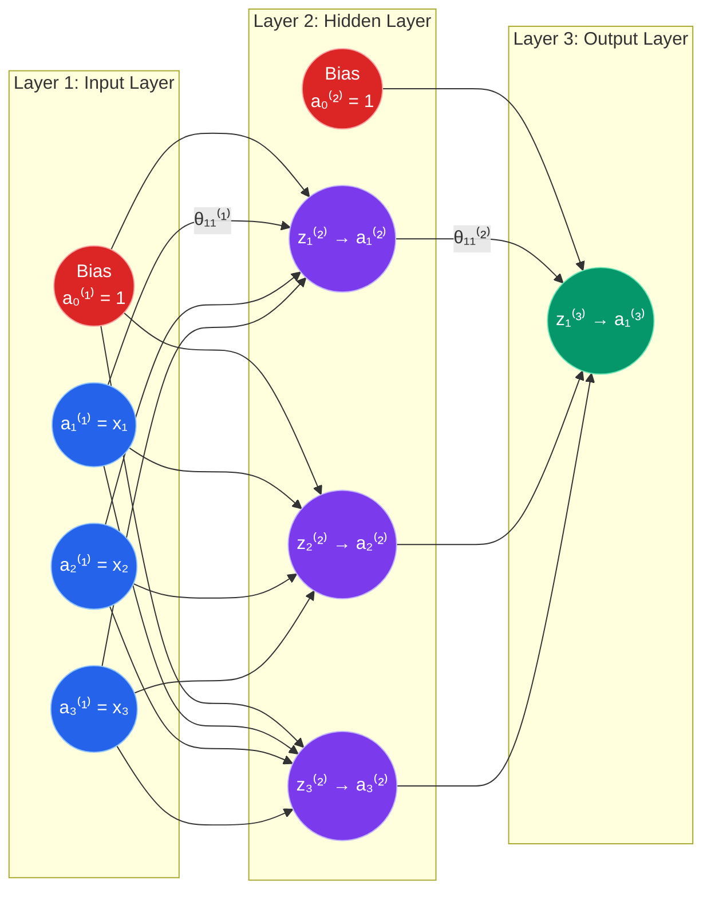

# 📘 Week 4 Study Notes: Artificial Neural Networks (ANN)

> **Course:** COS30082 — Applied Machine Learning  
> **Topic:** Artificial Neural Networks (ANN)  
> **Prerequisite:** Week 3 (Logistic Regression)

---

## Table of Contents

1. [Why Do We Need a Non-Linear Hypothesis?](#1-why-do-we-need-a-non-linear-hypothesis)
2. [Understanding Artificial Neural Networks](#2-understanding-artificial-neural-networks)
3. [From Logistic Regression to a Neuron](#3-from-logistic-regression-to-a-neuron)
4. [Neural Network Architecture](#4-neural-network-architecture)
5. [ANN Notation and Weight Dimensions](#5-ann-notation-and-weight-dimensions)
6. [The ANN Cost Function](#6-the-ann-cost-function)
7. [Feature Learning and Deep Networks](#7-feature-learning-and-deep-networks)
8. [Multiclass Classification](#8-multiclass-classification)
9. [Forward Propagation](#9-forward-propagation)
10. [Why Backpropagation Is Needed](#10-why-backpropagation-is-needed)
11. [Backward Propagation](#11-backward-propagation)
12. [The Backpropagation Algorithm](#12-the-backpropagation-algorithm)
13. [Backpropagation Intuition](#13-backpropagation-intuition)
14. [Random Weight Initialization](#14-random-weight-initialization)
15. [Logistic Regression vs ANN](#15-logistic-regression-vs-ann)
16. [Key Takeaways](#16-key-takeaways)
17. [Glossary](#17-glossary)

---

## 1. Why Do We Need a Non-Linear Hypothesis?

### The Problem: Real Data Is Often Complicated

<p align="center">
  
</p>

Suppose we want to classify an image as either a **dog** or a **cat**. Each pixel can be treated as an input feature:

$$
x = \begin{bmatrix}x_1 & x_2 & \cdots & x_n\end{bmatrix}^T
$$

For a grayscale image of $60 \times 60$ pixels:

$$
n = 60 \times 60 = 3600 \text{ features}
$$

For an RGB image, every pixel has red, green, and blue channels:

$$
n = 60 \times 60 \times 3 = 10{,}800 \text{ features}
$$

The classification process can be summarized as:

<p align="center">
  
</p>

### From Image Pixels to a Non-Linear Decision Boundary

<table align="center">
  <tr>
    <th align="center" width="33%">
      1️⃣ Extract Pixel Features
    </th>
    <th align="center" width="33%">
      2️⃣ Plot Training Examples
    </th>
    <th align="center" width="33%">
      3️⃣ Learn a Non-Linear Boundary
    </th>
  </tr>

  <tr>
    <td align="center" valign="top">
      <a href="https://github.com/user-attachments/assets/bfc159ba-595b-40c8-b46d-f8958ac14c21">
        
      </a>
    </td>
    <td align="center" valign="top">
      <a href="https://github.com/user-attachments/assets/d4df5120-5c6c-4d96-bcbe-0ef87d85aeac">
        
      </a>
    </td>
    <td align="center" valign="top">
      <a href="https://github.com/user-attachments/assets/62d846af-8c92-40a1-96e4-d303ea221713">
        
      </a>
    </td>
  </tr>

  <tr>
    <td align="center" valign="top">
      Selected pixel intensities become the input features
      <b>x<sub>1</sub></b> and <b>x<sub>2</sub></b>.
    </td>
    <td align="center" valign="top">
      Each image becomes a training point. 
      <br>🔵 = Dogs
      🔴 = Cats
    </td>
    <td align="center" valign="top">
      A non-linear decision boundary is needed to separate the two classes.
    </td>
  </tr>
</table>

### Why Not Add Polynomial Features?

From logistic regression, we know that polynomial terms can create a non-linear decision boundary. For example:

$$
h_\theta(x) = g(\theta_0 + \theta_1x_1 + \theta_2x_2 + \theta_3x_1^2 + \theta_4x_1x_2 + \theta_5x_2^2)
$$

However, manually adding quadratic features to an image causes the number of inputs to grow enormously.

The approximate number of second-order feature combinations is:

$$
\frac{n(n+1)}{2}
$$

For $n = 10{,}800$ RGB features:

$$
\frac{10{,}800(10{,}801)}{2} \approx 58.3 \text{ million features}
$$

<div align="center">

| Problem | Effect |
|---------|--------|
| Too many polynomial features | Very high memory usage |
| Manual feature construction | Difficult to decide which combinations matter |
| High-dimensional input | Expensive model training and prediction |
| Complex patterns | A simple linear boundary may underfit |

</div>

> [!IMPORTANT]
> **Neural networks provide a better alternative:** instead of manually creating millions of polynomial features, the hidden layers learn useful non-linear features automatically.

> **Analogy:** Polynomial feature engineering is like manually listing every possible combination of ingredients before cooking. A neural network learns which ingredient combinations are useful while it trains.

---

## 2. Understanding Artificial Neural Networks

### Inspiration from the Human Brain

The human brain contains interconnected biological neurons. A neuron receives signals, processes them, and sends an output to other neurons.

An **Artificial Neural Network (ANN)** follows a simplified version of the same idea:

<p align="center">
  
</p>

1. Receive input values
2. Multiply each input by a weight
3. Add the weighted inputs and a bias
4. Apply an activation function
5. Produce an output

### The Artificial Neuron

For inputs $x_1, x_2, \ldots, x_n$, weights $w_1, w_2, \ldots, w_n$, and bias $b$:

$$
z = b + \sum_{i=1}^{n} w_i x_i
$$

The neuron then applies an activation function $g$:

$$
a = g(z)
$$

<div align="center">

```text
Inputs x → Weighted Sum z → Activation g(z) → Output a
```

</div>

| Component | Purpose |
|-----------|---------|
| **Inputs** $x$ | Values supplied to the neuron |
| **Weights** $w$ or $\theta$ | Control the importance of each input |
| **Bias** $b$ | Shifts the activation threshold |
| **Weighted sum** $z$ | Combines the inputs before activation |
| **Activation** $g(z)$ | Introduces non-linearity |
| **Output** $a$ | Value passed to the next layer |

> **Analogy:** A neuron is like a panel of judges. Every judge gives a score ($x_i$), each judge has a different influence ($w_i$), and the bias adjusts the starting point. The activation function converts the total score into a decision signal.

---

## 3. From Logistic Regression to a Neuron

### Logistic Regression as a Single Neuron

Recall the logistic regression hypothesis:

$$
h_\theta(x) = g(\theta^T x)
$$

where the sigmoid function is:

$$
g(z) = \frac{1}{1+e^{-z}}
$$

and:

$$
z = \theta^T x
$$

Using a bias input $x_0=1$:

$$
z = \theta_0x_0 + \theta_1x_1 + \theta_2x_2 + \cdots + \theta_nx_n
$$

### Neuron Terminology for Logistic Regression

| Logistic Regression Term | ANN Term |
|--------------------------|----------|
| Features $x_1,\ldots,x_n$ | Input neurons |
| Intercept $\theta_0$ | Bias weight |
| Parameters $\theta$ | Weights |
| $\theta^Tx$ | Weighted sum $z$ |
| Sigmoid $g(z)$ | Activation function |
| $h_\theta(x)$ | Predicted output / activation |

For binary classification:

$$
0 < h_\theta(x) < 1
$$

The prediction can therefore be interpreted as:

$$
h_\theta(x)=P(y=1\mid x;\theta)
$$

> [!NOTE]
> Logistic regression can be viewed as a neural network with an input layer and an output neuron, but **no hidden layer**.

### Why a Hidden Layer Changes Everything

A logistic regression neuron directly maps the original inputs to the output. An ANN inserts one or more hidden layers. The hidden neurons create new learned features, allowing the model to represent much more complex patterns.

<table align="center">
<tr>

<td align="center" width="50%" valign="top">


<br>

Logistic Regression

</td>

<td align="center" width="50%" valign="top">


<br>

Neural Networks
</td></tr></table>

---

## 4. Neural Network Architecture

### The Three Main Layer Types

<div align="center">

| Layer | Role |
|-------|------|
| **Input layer** | Holds the original features $x$ |
| **Hidden layer(s)** | Learns intermediate feature representations |
| **Output layer** | Produces the final prediction $h_\theta(x)$ |

</div>

### A Single-Hidden-Layer Network

Consider a network with:

- 3 input features
- 3 hidden neurons
- 1 output neuron

<p align="center">
  
</p>

Every neuron in one layer is normally connected to every non-bias neuron in the next layer. This is called a **fully connected** or **dense** layer.

### Bias Units (encircled with blue colour)

A bias unit has a fixed activation of +1, where $l$ is the current layer:

$$
a_0^{(l)} = 1
$$

It is added to each non-output layer and has its own outgoing weights.

> [!WARNING]
> Bias units are **not counted** when stating the number of ordinary neurons $s_l$ in a layer, but the bias column **is included** in the weight matrix.

---

## 5. ANN Notation and Weight Dimensions

### Core Notation

| Symbol | Meaning |
|--------|---------|
| $L$ | Total number of layers |
| $s_l$ | Number of non-bias neurons in layer $l$ |
| $a_i^{(l)}$ | Activation of neuron $i$ in layer $l$ |
| $z_i^{(l)}$ | Weighted input to neuron $i$ in layer $l$ |
| $\Theta^{(l)}$ | Weight matrix mapping layer $l$ to layer $l+1$ |
| $\theta_{jk}^{(l)}$ | Weight from neuron $k$ in layer $l$ to neuron $j$ in layer $l+1$ |
| $h_\Theta(x)$ | Network prediction |



In this network, the total number of layers is $L=3$. The values $s_1=3$, $s_2=3$, and $s_3=1$ describe the number of non-bias neurons in each layer.

Each $z_i^{(l)}$ is the weighted input entering neuron $i$, while $a_i^{(l)}=g(z_i^{(l)})$ is its activation. The matrix $\Theta^{(l)}$ contains all weights connecting layer $l$ to layer $l+1$, whereas $\theta_{jk}^{(l)}$ represents one individual connection from neuron $k$ to neuron $j$.

> [!NOTE]
> Capital $\Theta$ is commonly used for a layer's complete weight matrix, while lowercase $\theta_{jk}$ represents one individual weight.

### Weight Matrix Dimension Rule

If layer $l$ has $s_l$ neurons and layer $l+1$ has $s_{l+1}$ neurons, then:

$$
\boxed{\Theta^{(l)} \in \mathbb{R}^{s_{l+1}\times(s_l+1)}}
$$

Why?

- **Rows:** one row for each destination neuron in layer $l+1$
- **Columns:** one column for each source neuron in layer $l$, plus one bias column

### Example

For 3 input neurons, 3 hidden neurons, and 1 output neuron:

<p align="center">
  
</p>

<div align="center">
  
| Mapping | Destination Neurons | Source Neurons + Bias | Matrix Size |
|---------|---------------------|-----------------------|-------------|
| Input (Layer 1) → Hidden (Layer 2) | 3 | $3+1=4$ | $3\times4$ |
| Hidden (Layer 2) → Output (Layer 3) | 1 | $3+1=4$ | $1\times4$ |

</div>

### Parameter Count

The total number of weights in this network is:

$$
(3\times4)+(1\times4)=16
$$

> **Memory trick:** **Next × (Current + 1)** gives the weight-matrix dimensions.

---
## 6. The ANN Cost Function

### Important Terminology

<div align="center">
  
| Symbol | Meaning |
|--------|---------|
| $K$ | Number of output neurons/classes |
| $L$ | Total number of network layers |
| $s_l$ | Number of non-bias neurons in layer $l$ |
| $m$ or $N$ | Number of training examples |

</div>

### Binary Classification Cost

For one sigmoid output, binary cross-entropy is:

$$
J(\Theta)=-\frac{1}{m}\sum_{i=1}^{m}\left[y^{(i)}\log h_\Theta(x^{(i)})+(1-y^{(i)})\log\left(1-h_\Theta(x^{(i)})\right)\right]
$$

### Multiclass Classification Cost

For $K$ output neurons:

$$
J(\Theta)=-\frac{1}{m}\sum_{i=1}^{m}\sum_{k=1}^{K}\left[y_k^{(i)}\log h_\Theta(x^{(i)})_k+(1-y_k^{(i)})\log\left(1-h_\Theta(x^{(i)})_k\right)\right]
$$

The purpose of training is to find weights that minimize $J(\Theta)$.

### What the Cost Measures

| Prediction | Actual Class | Cost Behaviour |
|------------|--------------|----------------|
| Confident and correct | Match | Very small cost |
| Uncertain | Either | Moderate cost |
| Confident and wrong | Mismatch | Very large cost |

> **Analogy:** The cost function is the network's report card. Forward propagation answers the questions; the cost tells the network how badly its answers differ from the targets.

---

## 7. Feature Learning and Deep Networks

### Hidden Neurons Learn New Features

Each hidden activation is a learned function of the previous layer:

$$
a^{(2)}=g\left(\Theta^{(1)}x\right)
$$

Instead of manually selecting polynomial terms, the network learns which combinations of inputs help reduce the prediction error.

<div align="center">
  
| Model | Feature Representation |
|-------|------------------------|
| Logistic Regression | Uses the supplied features directly |
| ANN with hidden layers | Learns new features from the supplied features |

</div>

### Deeper Networks

A deeper network contains more than one hidden layer:

<p align="center">
  
</p>

As information travels deeper through the network, representations can become increasingly abstract.

For image classification, a simplified interpretation is:

<div align="center">
  
| Layer | Possible Learned Feature |
|-------|--------------------------|
| Early hidden layer | Edges and colour changes |
| Middle hidden layer | Curves, textures, eyes, ears |
| Deeper hidden layer | Complete object parts or shapes |
| Output layer | Dog, cat, or another class |

</div>

> [!IMPORTANT]
> The network is not explicitly told to detect an edge or an ear. These useful intermediate features are learned through training.

---

## 8. Multiclass Classification

### More Than Two Classes

Suppose an image must be classified into three classes:

1. Dog
2. Penguin
3. Tiger

The output layer should contain one neuron per class:

$$
h_\Theta(x)\in\mathbb{R}^3
$$

### One-Hot Encoding

Instead of storing the label as 1, 2, or 3, represent it as a vector:

<div align="center">
  
| Class | One-Hot Target $y$ |
|-------|--------------------|
| Dog | $\left[1,0,0\right]^T$ |
| Penguin | $\left[0,1,0\right]^T$ |
| Tiger | $\left[0,0,1\right]^T$ |
  
</div>

Only the position belonging to the correct class is 1.

### Interpreting the Output

If the network produces:

$$ h_\Theta(x)=\begin{bmatrix}0.08 \\\\0.87 \\\\0.05\end{bmatrix} $$

then the second output is largest, so the model predicts **penguin**.

$$
\hat{y}=\arg\max_k h_\Theta(x)_k
$$

### Binary vs Multiclass Output

| Problem | Target | Network Output |
|---------|--------|----------------|
| Binary classification | $y\in\{0,1\}$ | $h_\Theta(x)\in\mathbb{R}$ |
| $K$-class classification | $y\in\mathbb{R}^K$ | $h_\Theta(x)\in\mathbb{R}^K$ |

> [!NOTE]
> For mutually exclusive classes, modern neural networks commonly use **softmax** in the output layer so that all $K$ output probabilities sum to 1.

---

## 9. Forward Propagation

### What Is Forward Propagation?

**Forward propagation** computes the network's prediction / calculates the weighted sum of $z_j^{(l)}$ by moving from the input layer to the output layer.

For each layer:

$$z^{(l+1)}=\Theta^{(l)}a^{(l)}$$

$$a^{(l+1)}=g\left(z^{(l+1)}\right)$$

The activation function is applied element by element.

### Step-by-Step Forward Propagation for One Hidden Layer

Consider a neural network containing:

- Three input features
- Three hidden neurons
- One output neuron
- A bias unit in Layers 1 and 2

Forward propagation moves information from the input layer to the output layer to calculate the network prediction \(h_\Theta(x)\).

---

### Step 1: Pass the Inputs to the Hidden Layer

<p align="center">
  
</p>

<p align="center">
  <em>
    The input features and bias unit are multiplied by the Layer 1
    weight matrix to calculate the weighted inputs of the hidden neurons.
  </em>
</p>

The input-layer activations are the input features:

$$a^{(1)}=\begin{bmatrix}x_1 \cr
x_2 \cr
x_3\end{bmatrix}$$

A fixed bias unit $\(a_0^{(1)}=x_0=1\)$ is added to form the bias-augmented input vector:

$$\{a}^{(1)}=\begin{bmatrix}1 \cr x_1 \cr x_2 \cr x_3\end{bmatrix}$$

The weighted inputs entering the three hidden neurons are calculated using:

$$z^{(2)}=\Theta^{(1)}\{a}^{(1)}$$

The corresponding matrix dimensions are:

$$\underbrace{z^{(2)}}_{3\times1}=\underbrace{\Theta^{(1)}}_{3\times4}\underbrace{\{a}^{(1)}}_{4\times1}$$

The resulting vector contains one weighted input for each hidden neuron:

$$z^{(2)}=\begin{bmatrix}z_1^{(2)} \cr z_2^{(2)} \cr z_3^{(2)}\end{bmatrix}$$

---

### Step 2: Activate the Hidden Neurons

<p align="center">
  
</p>

<p align="center">
  <em>
    Each hidden neuron applies the activation function to its weighted
    input, producing the hidden-layer activations.
  </em>
</p>

The activation function \(g\) is applied element-wise to the hidden-layer weighted inputs:

$$
a^{(2)}=g\left(z^{(2)}\right)
$$

Therefore:

$$a^{(2)}=\begin{bmatrix}g\left(z_1^{(2)}\right) \cr g\left(z_2^{(2)}\right) \cr g\left(z_3^{(2)}\right)\end{bmatrix}=\begin{bmatrix}a_1^{(2)} \cr a_2^{(2)} \cr a_3^{(2)}\end{bmatrix}$$

For each hidden neuron:

$$a_j^{(2)}=g\left(z_j^{(2)}\right),\qquad j=1,2,3$$

---

### Step 3: Add the Hidden-Layer Bias

<p align="center">
  
</p>

<p align="center">
  <em>
    A fixed bias activation is added to the hidden layer before its
    activations are passed to the output neuron.
  </em>
</p>

The activation function produces only the three ordinary hidden-neuron activations. Before propagating them to Layer 3, another bias unit is added:

$$a_0^{(2)}=1$$

The bias-augmented hidden-layer vector is therefore:

$$\{a}^{(2)}=\begin{bmatrix}1 \cr2 a_1^{(2)} \cr a_2^{(2)} \cr a_3^{(2)}\end{bmatrix}$$

> [!NOTE]
> $\(\{a}^{(l)}\)$ indicates that the activation vector includes the bias unit \(a_0^{(l)}=1\).

---

### Step 4: Propagate to the Output Layer

<p align="center">
  
</p>

<p align="center">
  <em>
    The output neuron applies the activation function to its weighted
    input, producing the final network prediction.
  </em>
</p>

The output neuron combines the hidden-layer activations using the second weight matrix:

$$
z^{(3)}=\Theta^{(2)}\{a}^{(2)}
$$

The matrix dimensions are:

$$\underbrace{z^{(3)}}_{1\times1}=\underbrace{\Theta^{(2)}}_{1\times4}\underbrace{\{a}^{(2)}}_{4\times1}$$

Because the network contains one output neuron, \(z^{(3)}\) is a scalar.

The activation function is then applied:

$$a^{(3)}=g\left(z^{(3)}\right)$$

Therefore:

$$\boxed{h_\Theta(x)=a^{(3)}=g\left(z^{(3)}\right)}$$

---

### Expanded Hidden-Layer Calculations

For hidden neuron \(j\), the general weighted-input equation is:

$$z_j^{(2)}=\theta_{j0}^{(1)}+\sum_{k=1}^{3}\theta_{jk}^{(1)}x_k$$

The corresponding activation is:

$$a_j^{(2)}=g\left(z_j^{(2)}\right)$$

For the first hidden neuron:

$$z_1^{(2)}=\theta_{10}^{(1)}+\theta_{11}^{(1)}x_1+\theta_{12}^{(1)}x_2+\theta_{13}^{(1)}x_3$$

$$a_1^{(2)}=g\left(z_1^{(2)}\right)$$

For the second hidden neuron:

$$z_2^{(2)}=\theta_{20}^{(1)}+\theta_{21}^{(1)}x_1+\theta_{22}^{(1)}x_2+\theta_{23}^{(1)}x_3$$

$$a_2^{(2)}=g\left(z_2^{(2)}\right)$$

For the third hidden neuron:

$$z_3^{(2)}=\theta_{30}^{(1)}+\theta_{31}^{(1)}x_1+\theta_{32}^{(1)}x_2+\theta_{33}^{(1)}x_3$$

$$a_3^{(2)}=g\left(z_3^{(2)}\right)$$

---

### Expanded Output-Layer Calculation

Since \(a_0^{(2)}=1\), the output-layer weighted input is:

$$z^{(3)}=\theta_{10}^{(2)}+\theta_{11}^{(2)}a_1^{(2)}+\theta_{12}^{(2)}a_2^{(2)}+\theta_{13}^{(2)}a_3^{(2)}$$

The final prediction is:

$$h_\Theta(x)=a^{(3)}=g\left(z^{(3)}\right)$$

> **Analogy:** Forward propagation is like doing a presentation from beginning to end. The input layer represents the collected research, facts, and findings. The hidden layers filter the important information, connect related ideas, and organise them into clear slides. The output layer represents the final conclusion or message presented to the audience.

---

## 10. Why Backpropagation Is Needed

### The Training Problem

Forward propagation tells us the prediction, and the cost function tells us how wrong it is. We still need to determine:

> Which weights caused the error, and how should each one change?

The gradient answers this question:

$$
\frac{\partial J(\Theta)}{\partial \theta_{jk}^{(l)}}
$$

It measures how sensitive the cost is to a small change in one weight.

### Gradient Descent Update

Once the gradient is known:

$$
\theta_{jk}^{(l)}:=\theta_{jk}^{(l)}-\alpha\frac{\partial J(\Theta)}{\partial\theta_{jk}^{(l)}}
$$

where $\alpha$ is the learning rate.

### Why Calculate Backwards?

The prediction depends on the last hidden layer, which depends on the previous hidden layer, and so on. The **chain rule** lets the output error be traced backwards through these dependencies.

<p align="center">
  
</p>

<p align="center">
  <em>Forward propagation:   Input  → Hidden → Output → Cost</em>
</p>

<p align="center">
  
</p>

<p align="center">
  <em>Backward propagation:  Input  ← Hidden ← Error  ← Cost</em>
</p>

> **Analogy:** If the final product from a production line is faulty, backpropagation inspects the last process first, then traces responsibility backwards to earlier processes.

---

## 11. Backward Propagation

### Error-Term Notation

$$
\delta_j^{(l)}=\text{error associated with neuron }j\text{ in layer }l
$$

In calculus terms:

$$
\delta_j^{(l)}=\frac{\partial J}{\partial z_j^{(l)}}
$$

### Step 1: Output-Layer Error

For sigmoid output activation with cross-entropy loss, the output error simplifies to:

$$
\boxed{\delta^{(L)}=a^{(L)}-y}
$$

Since $a^{(L)}=h_\Theta(x)$:

$$
\delta^{(L)}=h_\Theta(x)-y
$$

> [!NOTE]
> With another loss/activation pairing, the derivative may not simplify this way. In the general chain-rule form, the loss derivative and activation derivative must both be included.

### Step 2: Hidden-Layer Error

Move backwards through the hidden layers:

$$
\boxed{\delta^{(l)}=\left(\Theta^{(l)}\right)^T\delta^{(l+1)}\odot g'\left(z^{(l)}\right)}
$$

where $\odot$ means element-wise multiplication.

The bias component is excluded when the error is passed to the ordinary neurons of the preceding layer.

For sigmoid activation:

$$
g'(z)=g(z)(1-g(z))
$$

Since $a=g(z)$:

$$
g'(z)=a(1-a)
$$

### Step 3: Weight Gradients

The gradient for the weight from neuron $k$ in layer $l$ to neuron $j$ in layer $l+1$ is:

$$
\boxed{\frac{\partial J}{\partial\theta_{jk}^{(l)}}=\delta_j^{(l+1)}a_k^{(l)}}
$$

In matrix form for one training example:

$$
\frac{\partial J}{\partial\Theta^{(l)}}=\delta^{(l+1)}\left(a^{(l)}\right)^T
$$

### What About the Bias Gradient?

Because a bias input is fixed at 1:

$$
\frac{\partial J}{\partial\theta_{j0}^{(l)}}=\delta_j^{(l+1)}
$$

### No $\delta^{(1)}$

We normally do not calculate an error term for the input layer because it contains given feature values, not trainable neuron activations.

> [!IMPORTANT]
> Backpropagation does **not** update the weights by itself. It efficiently computes the gradients; an optimizer such as gradient descent then uses those gradients to update the weights.

---

## 12. The Backpropagation Algorithm

Given the training set:

$$
\left(x^{(1)},y^{(1)}\right),\left(x^{(2)},y^{(2)}\right),\ldots,\left(x^{(m)},y^{(m)}\right)
$$

the complete training process is:

### Step 1: Initialize the Parameters

Initialize each weight matrix $\Theta^{(l)}$ using small random values.

### Step 2: Forward Propagation

For each layer, calculate:

$$
z^{(l+1)}=\Theta^{(l)}a^{(l)}
$$

$$
a^{(l+1)}=g(z^{(l+1)})
$$

Continue until $a^{(L)}=h_\Theta(x)$ is obtained.

### Step 3: Compute the Output Error

For sigmoid plus cross-entropy, calculate:

$$
\delta^{(L)}=a^{(L)}-y
$$

### Step 4: Backpropagate the Error

For hidden layers from right to left:

$$
\delta^{(l)}=\left(\Theta^{(l)}\right)^T\delta^{(l+1)}\odot g'(z^{(l)})
$$

### Step 5: Compute and Accumulate Gradients

$$
\Delta^{(l)}:=\Delta^{(l)}+\delta^{(l+1)}(a^{(l)})^T
$$

After processing the required examples, average the accumulated gradients.

### Step 6: Update the Weights

$$
\Theta^{(l)}=\Theta^{(l)}-\alpha\frac{\partial J}{\partial\Theta^{(l)}}
$$

### Step 7: Repeat

Repeat the forward and backward passes over many epochs until the cost converges or another stopping condition is met.

<div align="left">

```text
Random Initialization
         ↓
Forward Propagation
         ↓
Compute Cost and Output Error
         ↓
Backward Propagation
         ↓
Compute Gradients
         ↓
Update Weights
         ↓
Repeat Until Convergence
```

</div>

---

## 13. Backpropagation Intuition

### Forward: Combine Information

During forward propagation, a neuron computes a weighted sum of activations from the left:

$$
z_j^{(l+1)}=\theta_{j0}^{(l)}a_0^{(l)}+\theta_{j1}^{(l)}a_1^{(l)}+\cdots+\theta_{js_l}^{(l)}a_{s_l}^{(l)}
$$

It asks:

> Given the current weights, what should this neuron output?

### Backward: Assign Responsibility

During backward propagation, a hidden neuron's error combines the downstream errors influenced by that neuron:

$$
\delta_j^{(l)}=\left(\sum_r\theta_{rj}^{(l)}\delta_r^{(l+1)}\right)g'(z_j^{(l)})
$$

It asks:

> How much did this neuron contribute to the final error?

### Meaning of a Weight Gradient

$$
\frac{\partial J}{\partial\theta_{jk}^{(l)}}
$$

| Gradient Value | Meaning |
|----------------|---------|
| Large positive | Increasing the weight increases cost strongly; reduce it |
| Large negative | Increasing the weight reduces cost strongly; increase it |
| Near zero | Small local effect on cost |

### Credit Assignment

Backpropagation solves the **credit-assignment problem**: it determines how much credit or blame each weight should receive for the final prediction error.

> **Analogy:** Imagine a group assignment receives a low mark. Backpropagation traces each part of the final submission back to the team member and earlier decision that influenced it, then estimates what should change next time.

---

## 14. Random Weight Initialization

### Why Not Initialize Every Weight to Zero?

If all hidden neurons start with identical weights, they receive the same inputs, compute the same activations, receive the same gradients, and remain identical after every update.

This is called the **symmetry problem**.

### What Goes Wrong

Suppose all three hidden neurons have the same weights:

$$
\theta_1=\theta_2=\theta_3
$$

Then:

$$
a_1^{(2)}=a_2^{(2)}=a_3^{(2)}
$$

All three neurons learn the same feature, so the network wastes its hidden units.

### The Solution

Initialize weights to small random values close to zero:

$$
\theta_{jk}^{(l)}\sim\text{small random distribution}
$$

This breaks symmetry, allowing different neurons to learn different features.

| Initialization | Result |
|----------------|--------|
| All zeros | Hidden neurons stay identical ❌ |
| Same constant | Hidden neurons stay identical ❌ |
| Small random values | Hidden neurons can specialize ✅ |

> [!WARNING]
> The goal is not simply “randomness.” The scale also matters: weights that are too large or too small can make training unstable or slow.

> **Analogy:** If every team member receives exactly the same starting instructions and makes every decision identically, the team behaves like one person. Slightly different starting points allow members to specialize.

---

## 15. Logistic Regression vs ANN

| Feature | Logistic Regression | Artificial Neural Network |
|---------|---------------------|---------------------------|
| Architecture | No hidden layer | One or more hidden layers |
| Decision boundary | Best for approximately linear separation | Can learn complex non-linear boundaries |
| Feature learning | Relies mainly on supplied features | Learns intermediate features |
| Data requirement | Often effective on small datasets | Often benefits from more data |
| Computation | Relatively fast and inexpensive | More computationally expensive |
| Interpretability | Easier to interpret | More difficult to interpret |
| Cost surface | Convex for standard logistic regression | Generally non-convex |
| Minimum | Global minimum is reachable for convex cost | May contain multiple local minima or saddle points |
| Best use | Simple, robust classification baseline | Complex patterns such as image data |

### Convex vs Non-Convex Cost

For standard logistic regression, the cross-entropy cost is convex. This means there is one global minimum.

For a neural network, interactions among many layers and weights create a non-convex cost surface. Different initializations may lead to different trained solutions.

<table align="center">
<tr>

<td align="center" width="50%" valign="top">


<br>
Logistic Regression (Convex cost surface)

</td>

<td align="center" width="50%" valign="top">


<br>
Neural Networks (Non-convex cost surface)
</td></tr></table>

### Which One Should You Choose?

| Scenario | Recommended Starting Point |
|----------|----------------------------|
| Small, structured, approximately linearly separable dataset | Logistic Regression |
| Need a simple and interpretable baseline | Logistic Regression |
| Image or other high-dimensional pattern data | ANN |
| Strong non-linear relationships | ANN |
| Large dataset and sufficient computational resources | ANN |

> [!TIP]
> Start with logistic regression as a baseline when it is reasonable. Use an ANN when the simpler model cannot capture the required non-linear structure.

> [!IMPORTANT]
> Always check matrix dimensions before doing the arithmetic. Most hand-calculation errors in forward propagation come from forgetting the bias term or reversing the weight-matrix dimensions.

---

## 16. Key Takeaways

> [!IMPORTANT]
> **The 15 things to remember from Week 4:**

1. Real-world classification problems often require a **non-linear hypothesis**
2. Polynomial expansion becomes impractical for high-dimensional data such as images
3. An artificial neuron computes a weighted sum and applies an **activation function**
4. Logistic regression is equivalent to a neural network with **no hidden layer**
5. Hidden layers automatically learn new representations of the original features
6. The three main layer types are **input, hidden, and output**
7. A bias unit has a fixed activation of 1 and shifts a neuron's threshold
8. The weight matrix dimension is $s_{l+1}\times(s_l+1)$
9. **Forward propagation** moves left to right to compute $h_\Theta(x)$
10. Multiclass ANN targets use one-hot vectors and normally one output neuron per class
11. **Backpropagation** moves right to left and applies the chain rule to compute gradients
12. For sigmoid plus cross-entropy, the output error is $\delta^{(L)}=a^{(L)}-y$
13. Backpropagation computes gradients; gradient descent uses them to update weights
14. Weights must be randomly initialized to break symmetry between hidden neurons
15. ANN models learn complex non-linear patterns, but their optimization problem is generally non-convex

---

## 17. Glossary

| Term | Definition |
|------|-----------|
| **Activation** | The output of a neuron after its activation function is applied |
| **Activation Function** | A function such as sigmoid that transforms a neuron's weighted input and introduces non-linearity |
| **Artificial Neural Network (ANN)** | A model made of connected layers of artificial neurons |
| **Backpropagation** | An efficient chain-rule algorithm that computes cost gradients from the output layer backwards |
| **Bias Unit** | A fixed input of 1 that allows a neuron to shift its activation threshold |
| **Chain Rule** | Calculus rule used to differentiate a sequence of dependent functions |
| **Cost Function** | A measure of how far model predictions are from their targets |
| **Deep Neural Network** | A neural network containing multiple hidden layers |
| **Dense Layer** | A layer in which every input is connected to every neuron |
| **Epoch** | One complete pass through the training dataset |
| **Feature Learning** | Automatically learning useful intermediate representations from data |
| **Forward Propagation** | Computing activations from the input layer to the output layer |
| **Gradient** | The derivative of the cost with respect to a parameter |
| **Hidden Layer** | A layer between the input and output that learns intermediate features |
| **Learning Rate** | Step size $\alpha$ used when updating weights |
| **Non-Convex Function** | A function whose cost surface can contain several local minima and saddle points |
| **One-Hot Encoding** | A target vector with 1 at the correct class position and 0 elsewhere |
| **Output Layer** | The final layer that produces the network prediction |
| **Random Initialization** | Starting weights at small random values to break neuron symmetry |
| **Symmetry Problem** | Identically initialized neurons learn identical features and remain redundant |
| **Weight** | A trainable parameter controlling the strength of a connection |
| **Weight Matrix** | A matrix containing all weights connecting one layer to the next |
| **Weighted Sum** | The linear combination $z=\theta^Ta$ computed before activation |

---

> [!TIP]
> **Study tip for Week 4:** Make sure you can:
> 1. Explain why polynomial features become impractical for image classification
> 2. Label the input, hidden, output, and bias units in a network diagram
> 3. Determine the dimension of $\Theta^{(l)}$ from two layer sizes
> 4. Perform one complete forward-propagation calculation by hand
> 5. Convert a multiclass label into a one-hot vector
> 6. Explain forward propagation and backpropagation in one sentence each
> 7. State the output and hidden-layer error equations
> 8. Explain why zero initialization fails
> 9. Compare logistic regression with ANN and select an appropriate model

